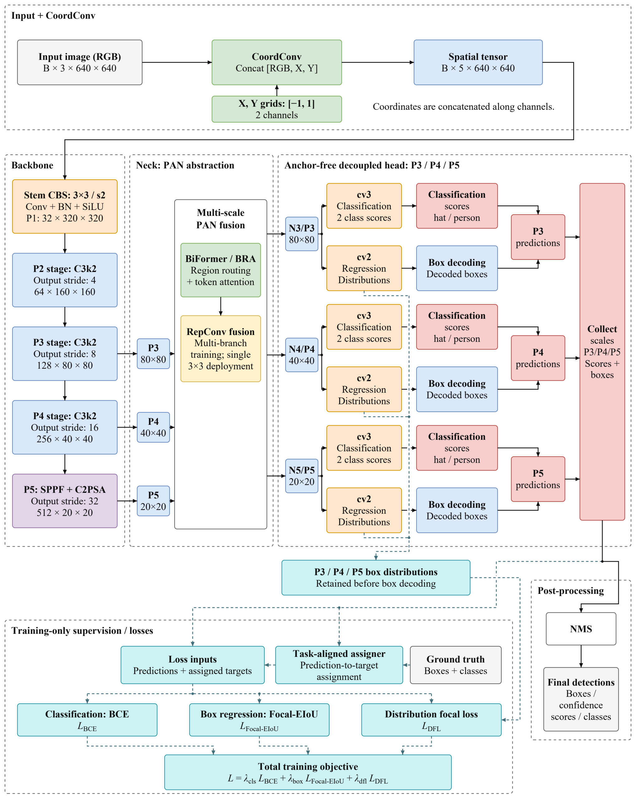
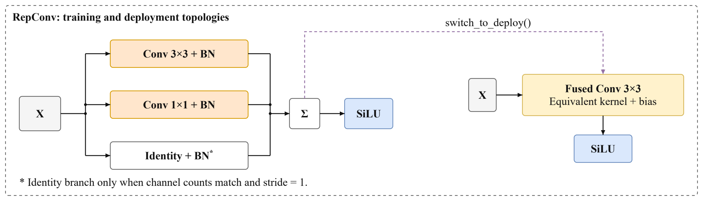
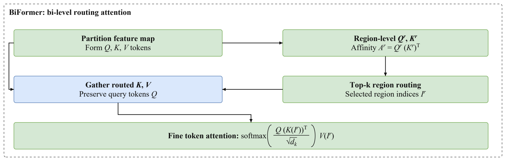
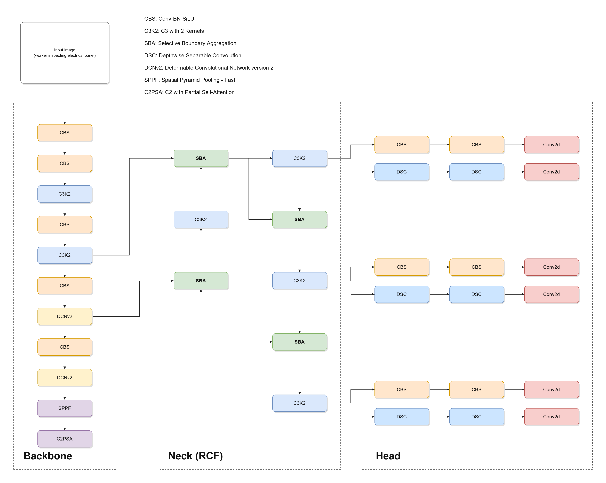
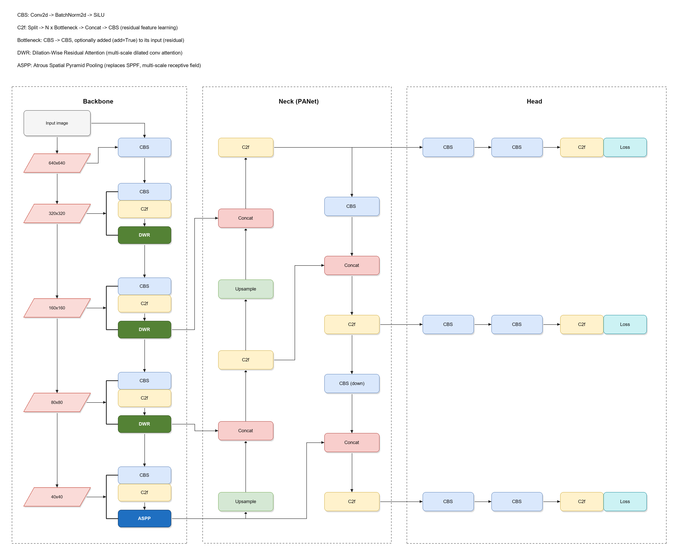

# Giải thích kiến trúc Rep-YOLO11s và so sánh với hai baseline

**Ngày biên soạn:** 05-10-2026. **Mục đích:** tài liệu học và thuyết minh phương pháp, giải thích từ luồng dữ liệu đến lý do thiết kế; không phải báo cáo tái chạy benchmark.

Ba hình của nhóm mô tả **một detector và hai module bên trong**, không phải ba detector độc lập. Hai hình baseline mô tả hai detector khác. Tài liệu lần lượt giải thích cả năm hình, sau đó so sánh.

## Mục lục

1. [Phạm vi, nguồn và cách đọc](#pham-vi)
2. [Các khái niệm cần hiểu trước](#nen-tang)
3. [Hình overall của nhóm: từ ảnh đến detection](#overall)
4. [Nhánh huấn luyện: TAL và ba loss](#training)
5. [Hình RepConv: tại sao train nhiều nhánh, deploy một nhánh?](#repconv)
6. [Hình BiFormer: định tuyến vùng và attention token](#biformer)
7. [Baseline YOLO11 với DCNv2 và RCF/SBA](#baseline-rcf)
8. [Baseline YOLOv8 với DWR, ASPP và NWD](#baseline-dwr)
9. [So sánh trực tiếp cách ba detector hoạt động](#so-sanh)
10. [Lập luận cho hướng thiết kế của nhóm](#lua-chon)
11. [Cải tiến kiến trúc khác gì với cải thiện đã đo được?](#cai-tien)
12. [Câu hỏi thường gặp khi trình bày và bảo vệ](#hoi-dap)
13. [Nguồn tham khảo và điểm cần thống nhất trong manuscript](#nguon)

<a id="pham-vi"></a>
## 1. Phạm vi, nguồn và cách đọc

### 1.1. Năm hình được giải thích

| Ký hiệu trong tài liệu | Hình | Ý nghĩa |
|---|---|---|
| G1 | [Overall Rep-YOLO11s](<C:/Users/nvtha/Downloads/shwd/AAIML 2027/FIGURE_PACKAGE/rep_yolo11s_overall_ieee.png>) | Toàn bộ luồng detector và supervision. |
| G2 | [RepConv detail](<C:/Users/nvtha/Downloads/shwd/AAIML 2027/FIGURE_PACKAGE/repconv_detail_ieee.png>) | Hai graph train/deploy của một module. |
| G3 | [BiFormer detail](<C:/Users/nvtha/Downloads/shwd/AAIML 2027/FIGURE_PACKAGE/biformer_detail_ieee.png>) | Cơ chế core bi-level routing attention. |
| B1 | [YOLO11 RCF — bản đã căn chỉnh](<C:/Users/nvtha/Downloads/shwd/VE_HINH_ANH_BASELINE/ALIGNED_BASELINES/_YOLO11_rcf_architecture_aligned.png>) | Hình có cả DCNv2 và SBA; đối chiếu với baseline kết hợp YOLO-DCRCF. |
| B2 | [YOLOv8 DWR–ASPP — bản đã căn chỉnh](<C:/Users/nvtha/Downloads/shwd/VE_HINH_ANH_BASELINE/ALIGNED_BASELINES/yolov8_dwr_aspp_final2_aligned.png>) | Backbone DWR/ASPP, neck PAN và ba đầu ra đa tỉ lệ. |

### 1.2. Ba mức độ khẳng định

- **Theo hình:** khối hoặc đường nối đang được thể hiện trực tiếp trong năm ảnh.
- **Theo nguồn:** cơ chế được giải thích bằng paper gốc hoặc implementation chính thức.
- **Lập luận thiết kế:** phân tích vì sao lựa chọn có thể phù hợp với bài toán. Đây không phải bằng chứng rằng nhóm đã thử và loại mọi phương án khác, cũng không phải nhật ký lịch sử quyết định của nhóm.

Phần giải thích Rep-YOLO11s bám theo G1–G3 và Figure 2 trong [manuscript của nhóm](<C:/Users/nvtha/Downloads/shwd/Final_REVIEW_1/Rep-YOLO11s_Master_Paper_IEEE_v2.pdf>). Module local dùng để kiểm tra phép toán là [custom_ablation_modules.py](<C:/Users/nvtha/Downloads/shwd/shwd-benchmark-code_1/custom_ablation_modules.py:1>); file này ghi rõ các module standalone, chưa chứng minh graph tích hợp cuối cùng.

**Giới hạn cụ thể:** G1 đặt RepConv ở neck trong khi Section III.B của PDF nói backbone. Số kênh P2/P3 trong G1 cũng khác output C3k2 của YOLO11s stock đối chiếu. Tài liệu giải thích bản hình hiện tại, đồng thời giữ những điểm cần xác minh ở mục 13; không tự sửa kiến trúc để che mâu thuẫn.

<a id="nen-tang"></a>
## 2. Các khái niệm cần hiểu trước

### 2.1. Mô hình đang giải bài toán gì?

Detector nhận một ảnh và tìm các vùng thuộc lớp mục tiêu. Mỗi kết quả gồm một box, một class và một confidence score. Trong G1 có hai tên lớp `hat` và `person`.

Tên `person` trong file nhãn không tự chứng minh box bao toàn thân. Khi viết phần dataset, phải kiểm tra annotation của bản dữ liệu thực tế. Đặc biệt, “phát hiện hat/person” và “xác định một người cụ thể có vi phạm PPE không” là hai mức xử lý khác nhau: mức thứ hai có thể cần ghép quan hệ, tracking hoặc logic nghiệp vụ ngoài detector.

Các khó khăn mà thiết kế hướng đến gồm mục tiêu nhỏ, che khuất, nền giống mũ và hạn chế tính toán. Chúng là động cơ chọn module; không phải lý do để mặc định model đã xử lý hoàn toàn các tình huống đó.

### 2.2. Tensor và feature map

Một tensor ảnh thường viết $X\in\mathbb{R}^{B\times C\times H\times W}$:

| Ký hiệu | Nghĩa |
|---|---|
| B | Số ảnh trong batch. Khi xử lý từng frame, thường B=1. |
| C | Số kênh: ảnh RGB có 3; feature có thể có hàng chục/hàng trăm kênh. |
| H, W | Chiều cao và rộng của lưới. |
| Feature map | Biểu diễn học được; không còn đơn thuần là ảnh màu. |
| Token không gian | Vector đặc trưng tại một vị trí trên feature map. |

Một kênh feature có thể phản ứng với một kiểu cấu trúc, nhưng không nên gán chắc chắn “kênh 1 là cạnh mũ, kênh 2 là người”. Các biểu diễn thường phân tán qua nhiều kênh.

### 2.3. Convolution, stride, dilation và receptive field

Convolution sử dụng trọng số chia sẻ để phối hợp thông tin trong một lân cận. Kernel 3×3 lấy thông tin tại chín vị trí lưới cho mỗi vị trí output; kernel 1×1 phối hợp các kênh ngay tại vị trí đó.

- **Stride** là bước dịch của phép toán. Stride 2 thường giảm H/W khoảng hai lần.
- **Dilation** là khoảng cách giữa các vị trí lấy mẫu trong kernel; tăng tầm bao phủ mà không nhất thiết giảm H/W.
- **Receptive field** là vùng input có thể ảnh hưởng đến một output. Nhiều lớp CNN liên tiếp có thể tạo receptive field lớn; nói CNN “chỉ thấy 3×3 và không có context” là sai.
- **Output stride của stage** là mức giảm so với ảnh gốc, không phải stride của mọi convolution trong stage.

Với kernel k, padding p, dilation d và stride s:

$$H_{out}=\left\lfloor\frac{H+2p-d(k-1)-1}{s}+1\right\rfloor.$$

Ví dụ H=640, k=3, p=1, d=1, s=2 cho H_out=320. Cần phép floor; không dùng công thức rút gọn rồi bỏ qua làm tròn.

### 2.4. Các cách “kết hợp feature” không giống nhau

| Phép toán | Đầu vào/đầu ra | Ý nghĩa |
|---|---|---|
| Add / Σ | Các tensor tương thích shape → cùng shape | Cộng từng phần tử; như các nhánh RepConv. |
| Concat theo channel | Cùng H/W → tổng số kênh | Giữ feature của các nguồn cạnh nhau để lớp sau học phối hợp. |
| Upsample | Tăng H/W | Căn kích thước; không tự khôi phục chi tiết đã mất. |
| Downsample | Giảm H/W | Giảm chi phí, tăng mức khái quát; có thể mất chi tiết. |
| Attention/gating | Feature và trọng số phụ thuộc input | Chọn hoặc điều chỉnh mức đóng góp của thông tin. |
| Collect predictions | Nhiều tập dự đoán → một tập | Gom ứng viên detection; khác fusion feature trong neck. |

### 2.5. Backbone, neck, head, post-processing và loss

**Backbone** tạo feature ở nhiều độ sâu. **Neck** trao đổi thông tin giữa các mức. **Head** biến feature thành dự đoán lớp và box. **Post-processing** lọc/định dạng dự đoán. **Loss** so sánh dự đoán với target trong huấn luyện.

Một module có thể nằm ở vị trí khác trong nghiên cứu khác. Tên “RepConv” hoặc “attention” không quy định bắt buộc thuộc backbone hay neck.

<a id="overall"></a>
## 3. G1 — Hình overall của nhóm: từ ảnh đến detection



### 3.1. Đọc một vòng suy luận

```text
Ảnh RGB
  → ghép hai lưới tọa độ X/Y
  → stem và backbone đa tỉ lệ
  → neck PAN có BRA và RepConv
  → ba feature cho head P3/P4/P5
  → nhánh class và nhánh box tại mỗi mức
  → giải mã box, gom dự đoán
  → NMS
  → boxes / confidence scores / classes
```

Khi suy luận không cần ground truth, TAL hoặc tính loss. Khi huấn luyện, prediction trước NMS được dùng cho assignment và loss. G1 vẽ cả hai chế độ để giải thích toàn bộ vòng đời của model.

### 3.2. Input image và hai lưới tọa độ

Ảnh trong hình có shape $(B,3,640,640)$. Với hàng i và cột j, hai kênh bổ sung là:

$$C_x(i,j)=\frac{2j}{W-1}-1,\qquad C_y(i,j)=\frac{2i}{H-1}-1.$$

Ở trái ảnh, $C_x=-1$; ở phải ảnh, $C_x=1$. Tương tự trên/dưới theo $C_y$. Đây là dữ liệu được tạo theo vị trí lưới, không phải output nhận diện người và cũng không phải target huấn luyện.

Local `CoordConv.forward` ghép RGB, Cx, Cy theo chiều kênh. Vì vậy tensor trung gian có **5 kênh**, còn H/W giữ nguyên. Hai bản đồ không thay màu ảnh và không thêm hai vật thể mới. [Mã local](<C:/Users/nvtha/Downloads/shwd/shwd-benchmark-code_1/custom_ablation_modules.py:46>); nguồn ý tưởng: [CoordConv](https://proceedings.neurips.cc/paper/2018/hash/60106888f8977b71e1f15db7bc9a88d1-Abstract.html).

**Vì sao dùng?** Chia sẻ kernel giúp convolution xử lý cùng mẫu ở nhiều nơi. Trong điều kiện lý tưởng nó có tính *equivariance* theo dịch chuyển: dịch input thì feature dịch tương ứng, chứ không đơn giản là “bất biến vị trí”. Thêm tọa độ cho phép lớp sau học quan hệ với vị trí tuyệt đối trong khung ảnh.

**Vì sao không chỉ dùng RGB?** RGB có thể học một phần dấu hiệu vị trí gián tiếp từ nền, biên ảnh và context; CoordConv cung cấp tín hiệu trực tiếp hơn. Đổi lại, model có thể lệ thuộc góc camera hoặc bố cục training.

**Điều không được suy ra:** Cx/Cy không tự biểu diễn “mũ nằm trên đầu người”. Một mũ thấp trong ảnh vẫn có thể hợp lệ, và một xô cao trong ảnh vẫn có thể là xô. Quan hệ đối tượng phải được học từ appearance/context; tọa độ chỉ là một nguồn thông tin.

Hình tách khâu concat khỏi stem để nhìn rõ tensor 5 kênh. Class `CoordConv` local lại gói cả concat và convolution. Đây là khác biệt mức trình bày, không phải yêu cầu chạy hai CoordConv nối tiếp. Nếu dùng ảnh letterbox, lưới phải nhất quán với hệ tọa độ tensor sau tiền xử lý.

### 3.3. Stem CBS: cửa vào của backbone

CBS là **Conv + BatchNorm + SiLU**. Conv học bộ lọc; BN điều chỉnh phân bố activation; SiLU tạo phi tuyến $f(x)=x\sigma(x)$. Trong G1, Conv 3×3 stride 2 biến lưới 640² thành 320² và xuất 32 kênh theo manuscript.

Hai tọa độ được stem phối hợp với RGB ngay từ đầu. Ví dụ một trọng số đầu vào có thể học rằng cùng dấu hiệu màu nhưng ở những vị trí khác nhau cần feature khác nhau; đó vẫn là kết quả học, không phải quy tắc viết tay.

**Lý do thiết kế:** stem giữ convolution chuẩn, dễ thực thi trên phần cứng, đồng thời giảm chi phí cho các stage sau. Dùng stride 1 giữ nhiều chi tiết hơn nhưng tốn hơn; tăng stride quá sớm có thể bất lợi cho vật nhỏ. Không có một stride tối ưu cho mọi dữ liệu. Nguồn implementation: [Conv của Ultralytics](https://github.com/ultralytics/ultralytics/blob/v8.3.0/ultralytics/nn/modules/conv.py), [ConvBNAct local](<C:/Users/nvtha/Downloads/shwd/shwd-benchmark-code_1/custom_ablation_modules.py:23>).

### 3.4. P2/P3/P4: vì sao vừa giảm lưới vừa tăng kênh?

| Stage theo G1 | Output stride | Shape bỏ batch | Vai trò khái quát |
|---|---:|---|---|
| P1 / stem | 2 | 32×320×320 | Tạo đặc trưng ban đầu. |
| P2 / C3k2 stage | 4 | 64×160×160 | Duy trì lưới còn mịn. |
| P3 / C3k2 stage | 8 | 128×80×80 | Cổng feature phân giải cao tới neck. |
| P4 / C3k2 stage | 16 | 256×40×40 | Cân bằng chi tiết và context. |
| P5 / SPPF + C2PSA | 32 | 512×20×20 | Feature sâu và context rộng. |

**Các số kênh trên là nhãn của G1, không phải xác nhận cấu hình YOLO11s stock.** Stage còn bao gồm các phép giảm mẫu; ghi “C3k2 stage stride 8” không có nghĩa một C3k2 đơn lẻ convolution stride 8.

Giảm H/W làm số vị trí ít đi. Tăng C cho phép mỗi vị trí mang biểu diễn phong phú hơn. Với mũ rộng 16 pixel ở input, độ rộng hình học tương ứng chỉ khoảng hai bước lưới P3 và nửa bước lưới P5. Đây là ví dụ về mức lấy mẫu, không phải kết luận mũ chắc chắn biến mất hoặc mỗi ô chỉ nhìn đúng 8×8 pixel.

### 3.5. C3k2 làm gì và vì sao giữ nó?

C3k2 thuộc họ CSP/C2f: feature được chia nhánh, một phần qua các phép biến đổi rồi kết hợp lại. Implementation có thể dùng Bottleneck hoặc C3k tùy cấu hình. Cơ chế này hỗ trợ tái sử dụng feature và nhiều đường truyền gradient. [Định nghĩa C3k2](https://github.com/ultralytics/ultralytics/blob/v8.3.0/ultralytics/nn/modules/block.py).

Trong G1, C3k2 đảm nhiệm trích xuất feature nền tảng; các cải tiến không cần thay toàn bộ backbone. **Lập luận:** giữ nhiều thành phần baseline giúp giới hạn phạm vi thay đổi, thuận lợi cho ablation và tái sử dụng trọng số khi shape phù hợp. Tuy nhiên, stem 5 kênh không thể nạp nguyên tensor kernel RGB 3 kênh nếu không có cách khởi tạo/chuyển đổi rõ ràng.

Không nên giải thích C3k2 chỉ bằng câu “C3 có hai kernel khác kích thước”; tên viết tắt trong legend baseline không thay thế cấu trúc implementation.

### 3.6. SPPF và C2PSA: hai việc khác nhau

**SPPF:** xử lý feature ở các mức tầm nhìn bằng pooling nối tiếp rồi concat và convolution. Với pooling 5 stride 1, các bước lặp tạo vùng bao phủ tương đương lớn dần, thường được minh họa 5/9/13. H/W của feature trong module có thể giữ nguyên; đây không phải ba lần giảm phân giải.

**C2PSA:** chia feature theo kênh, cho một phần qua attention/biến đổi rồi ghép lại. Nó nằm ở phần sâu của backbone trong G1. **BRA nằm trong neck** và có cơ chế routing khác; không phải chỉ đổi tên C2PSA. [SPPF và C2PSA chính thức](https://github.com/ultralytics/ultralytics/blob/v8.3.0/ultralytics/nn/modules/block.py).

**Vì sao không thay luôn SPPF bằng ASPP giống B2?** Một lập luận hợp lý là giữ khâu context nền tảng và dành thay đổi cho routing tại neck. ASPP cũng là lựa chọn khả thi nhưng tạo thêm nhánh convolution và siêu tham số dilation; việc nó có lợi hơn hay không cần ablation. Giữ SPPF không chứng minh ASPP kém.

**Tại sao đã có C2PSA còn thêm BRA?** Chúng đặt ở hai điểm xử lý khác nhau và có cách chọn tương tác khác nhau. Tuy nhiên khả năng trùng chức năng vẫn có; cần so sánh C2PSA-only, BRA-only và cả hai, không mặc định “hai attention luôn hơn một”.

### 3.7. P3/P4/P5 vào neck: không phải cộng ba lưới khác cỡ

Ba cổng đi vào cụm neck biểu diễn bộ $(F_3,F_4,F_5)$. Cụm trả về $(N_3,N_4,N_5)$. Vì các lưới khác H/W, trước concat/add phải có căn chỉnh kích thước và, khi cần, số kênh.

Ý tưởng chung của feature pyramid là đưa thông tin ngữ nghĩa sâu tới mức lưới mịn, rồi trao đổi lại giữa các mức. [FPN](https://openaccess.thecvf.com/content_cvpr_2017/html/Lin_Feature_Pyramid_Networks_CVPR_2017_paper.html) và [PANet](https://openaccess.thecvf.com/content_cvpr_2018/html/Liu_Path_Aggregation_Network_CVPR_2018_paper.html) là nguồn nền tảng.

G1 ghi **PAN abstraction**: hình không liệt kê từng Upsample/Concat/Conv, số lần lặp hoặc vị trí chèn module ở từng scale. Vì vậy, hai hộp BRA → RepConv giải thích ý tưởng xử lý bên trong cụm; chưa cho phép khẳng định chỉ có đúng một BRA và một RepConv trong toàn neck.

**Vì sao dùng neck?** Feature nông giữ chi tiết nhưng ít ngữ nghĩa; feature sâu giàu ngữ nghĩa nhưng lưới thưa. Neck cho phép chúng bổ sung nhau. Upsample feature sâu không tự sinh lại đường viền bị mất; kết nối ngang từ backbone mới đưa thêm thông tin phân giải cao.

### 3.8. Ý nghĩa BiFormer → RepConv trong G1

Theo mức module của hình:

1. BRA tạo tương tác giữa token với các vùng được chọn theo nội dung.
2. RepConv tiếp tục biến đổi/phối hợp feature bằng convolution nhiều nhánh lúc train.
3. Khi deploy, các nhánh tuyến tính của từng RepConv được gộp lại.

Lập luận là phối hợp **chọn thông tin theo nội dung** với **biến đổi cục bộ thuận tiện triển khai**. RepConv không gộp được cả BRA vào một convolution3×3. Thứ tự đảo lại là một ứng viên ablation, không có định lý đảm bảo thứ tự trong hình tối ưu.

### 3.9. Ba output N3/N4/N5 và ba head

N3/N4/N5 là feature đã qua neck; G1 gắn thêm P3/P4/P5 để chỉ mức scale. Mỗi feature tách làm hai nhánh:

- **cv3:** phân lớp.
- **cv2:** hồi quy box dưới dạng phân phối.

Decoupled nghĩa là các lớp dự đoán cuối cho hai nhiệm vụ được tách; chúng vẫn dùng chung feature đầu vào và cùng ảnh hưởng backbone/neck khi tối ưu. Anchor-free nghĩa là không cần bộ anchor-box định sẵn theo chiều rộng/cao; vẫn cần điểm tham chiếu trên lưới. [Detect](https://github.com/ultralytics/ultralytics/blob/v8.3.0/ultralytics/nn/modules/head.py), [make_anchors/dist2bbox](https://github.com/ultralytics/ultralytics/blob/v8.3.0/ultralytics/utils/tal.py).

P3 thường thuận lợi hơn cho mục tiêu nhỏ do lưới mịn; P5 có context sâu. Đây không phải quy tắc “mũ chỉ vào P3, người chỉ vào P5”. Assignment khi train quyết định vị trí nào được giám sát cho từng GT.

Trong G1 **không có P2 detection head**. P2 backbone vẫn tồn tại nhưng không đồng nghĩa có head stride 4. Các thử nghiệm P2 trong tài liệu khác không nên tự đưa vào lời giải thích hình này.

### 3.10. cv3 và Classification scores

Đầu ra học được trước activation là logits z. Với head YOLO đối chiếu, scores dùng sigmoid $p=1/(1+e^{-z})$. Hai scores không bắt buộc cộng thành 1 như softmax hai lớp.

Score là độ tin cậy dự đoán, không bảo đảm được hiệu chuẩn như xác suất thống kê thực tế. Trong training, logits cần được giữ cho BCEWithLogitsLoss; không lấy scores sau sigmoid rồi đưa lại vào hàm loss đã có sigmoid bên trong.

**Vì sao tách nhánh classification?** Phân biệt class cần dấu hiệu ngữ nghĩa; chỉnh tọa độ cần thông tin hình học. Tách các lớp cuối cho phép chuyên biệt hóa hai nhiệm vụ, nhưng không loại hoàn toàn xung đột gradient trong feature dùng chung.

### 3.11. cv2, distributions và Box decoding

Thay vì trực tiếp xuất duy nhất bốn tọa độ, nhánh regression có thể xuất bốn phân phối rời rạc cho khoảng cách trái, trên, phải, dưới từ điểm lưới. Nếu có M bin, mỗi vị trí có 4M logits regression. M là cấu hình; không lấy mặc định của thư viện làm cấu hình đã xác nhận của nhóm.

Với một cạnh, sau softmax theo bin:

$$\hat d=\sum_{j=0}^{M-1}j\,p_j.$$

Ví dụ tự minh họa: $p_3=0.75,p_4=0.25$, các bin khác bằng 0, cho khoảng cách kỳ vọng 3.25. Với điểm lưới $(a_x,a_y)$:

$$x_1=a_x-\hat l,\quad y_1=a_y-\hat t,\quad x_2=a_x+\hat r,\quad y_2=a_y+\hat b.$$

Nhân stride chuyển đơn vị feature sang pixel input; nếu có letterbox còn cần đổi về ảnh gốc khi hiển thị. Đó là **decoding**, không phải NMS. Hình giữ cả distributions trước decode và boxes sau decode vì chúng phục vụ những loss khác nhau. Nguồn nguyên lý phân phối: [Generalized Focal Loss](https://proceedings.neurips.cc/paper_files/paper/2020/hash/f0bda020d2470f2e74990a07a607ebd9-Abstract.html).

### 3.12. Collect scales

Ở input 640 và ba lưới80²,40²,20², số vị trí là:

$$80^2+40^2+20^2=8400.$$

Đây là phép đếm theo hình, không phải số đối tượng được phát hiện. Nếu mỗi vị trí có một box và hai scores thì biểu diễn sau decode có 6 giá trị/vị trí, trước lọc. Layout tensor có thể là B×6×8400 hoặc dạng hoán vị tương đương tùy API.

Collect scales gom các ứng viên; nó không trung bình ba box cùng scale, không tạo thêm class và không là module học mới. Code có thể gom tensor trước rồi decode một lần; G1 diễn giải từng scale trước khi gom để dễ đọc, không mô tả thứ tự từng instruction.

### 3.13. NMS và Final detections

Nhiều vị trí có thể cùng dự đoán một vật thể. NMS giữ ứng viên score cao rồi loại các box trùng nhiều theo ngưỡng IoU; thường xử lý có xét lớp theo cấu hình. Confidence threshold lọc box yếu, còn IoU threshold của NMS kiểm soát mức trùng: hai ngưỡng khác mục đích. [NMS API](https://docs.pytorch.org/vision/stable/generated/torchvision.ops.nms.html).

G1 đặt NMS ngoài head vì đây là hậu xử lý. Final detections gồm **boxes, confidence scores, classes**. Không có ID thời gian vì hình chưa có tracker. Không có dây đi từ Final detections sang loss vì quá trình huấn luyện trong sơ đồ dùng prediction trước NMS.

**Vì sao giữ NMS?** Đây là cách xử lý nhiều dự đoán trùng trong thiết kế đang dùng. Chuyển sang NMS-free đòi hỏi thiết kế head/assignment/training tương ứng; không phải xóa hộp NMS là thành detector NMS-free đúng nghĩa.

### 3.14. Những lựa chọn nền tảng khác: tại sao khối này thay vì khối kia?

Các lập luận dưới đây giải thích sự phù hợp với graph đang chọn, không khẳng định nhóm đã có thí nghiệm chứng minh từng phương án thay thế kém hơn.

| Lựa chọn trong G1 | Phương án có thể thay | Lý do giữ lựa chọn hiện tại và đánh đổi |
|---|---|---|
| Conv 3×3 ở stem | Kernel lớn hơn hoặc nhiều Conv 1×1 | 3×3 phối hợp lân cận nhỏ; 1×1 riêng lẻ không lấy thêm hàng xóm. Kernel lớn có tầm bao phủ khác và số trọng số lớn hơn khi giữ channels. |
| BN trong CBS | Không normalization hoặc normalization khác | Kế thừa block YOLO và có thể fold vào Conv lúc eval. Tuy nhiên batch nhỏ hoặc phân bố dữ liệu thay đổi có thể ảnh hưởng thống kê BN. |
| SiLU | ReLU | SiLU trơn và không triệt tiêu hoàn toàn mọi đầu vào âm; phù hợp block đang dùng. Điều này không bảo đảm tăng mAP hơn ReLU trên dữ liệu nhóm. |
| C3k2 | Chuỗi Conv đơn hoặc thay toàn backbone | Giữ cấu trúc tái sử dụng feature của nền YOLO11, giảm số biến thay đổi trong nghiên cứu. Hiệu quả so với block khác cần cùng ngân sách channels/compute. |
| SPPF | ASPP | Giữ cơ chế pooling-context của nền, dành thay đổi chính cho neck. ASPP là đối chứng hợp lý khi muốn học các phạm vi dilation khác nhau. |
| Ba scale | Một scale hoặc thêm P2 | Ba mức cân bằng độ phân giải/context; một mức đơn giản hơn nhưng giảm lựa chọn feature, P2 tăng số vị trí đáng kể. |
| Head decoupled | Head dùng chung toàn bộ lớp cuối | Cho phép chuyên biệt hóa class/box, đổi lại có thêm các nhánh cuối. Không phải đóng góp riêng của nhóm. |
| Regression phân phối | Hồi quy trực tiếp bốn số | Hỗ trợ biểu diễn và giám sát phân phối qua DFL, đổi lại cần nhiều output channels và bước decode. |
| BCEWithLogits | Softmax cross-entropy hoặc focal classification | Phù hợp head sigmoid và target hiện tại; đổi loss phân lớp cần xem lại representation/weighting, không chỉ đổi tên trong sơ đồ. |
| NMS | Soft-NMS hoặc thiết kế NMS-free | Giữ hậu xử lý tương thích detector hiện tại. Phương án khác cần cấu hình/đánh giá riêng, đặc biệt trong ảnh đông người. |

Nguồn cho các block chuẩn: [Conv](https://github.com/ultralytics/ultralytics/blob/v8.3.0/ultralytics/nn/modules/conv.py), [BN](https://proceedings.mlr.press/v37/ioffe15.html), [SiLU](https://www.sciencedirect.com/science/article/pii/S0893608017302976), [Detect](https://github.com/ultralytics/ultralytics/blob/v8.3.0/ultralytics/nn/modules/head.py). Bảng là phân tích lựa chọn của tài liệu này, không phải kết quả benchmark từ các nguồn đó.

G1 cũng không vẽ một nhánh objectness riêng. Vì vậy không tự bổ sung công thức confidence bằng “objectness × class probability” từ một dòng YOLO khác vào phần giải thích hình hiện tại.

<a id="training"></a>
## 4. Nhánh huấn luyện: TAL và ba loss

### 4.1. Ground truth, assignment và prediction khác nhau thế nào?

GT gồm box và class được gán nhãn. Prediction là kết quả model hiện tại. Assignment quyết định prediction nào học từ GT nào; cần vì detector có nhiều vị trí hơn số đối tượng.

Nếu có ba mũ trong ảnh và 8400 vị trí dự đoán, không thể chỉ ghép ba GT lần lượt với ba vị trí đầu. Cần tiêu chí dựa trên vị trí và chất lượng prediction. Assignment tạo positive/foreground mask và target cho các nhánh.

### 4.2. Task-aligned assigner (TAL)

Ý tưởng task alignment phối hợp tín hiệu lớp và định vị. Một dạng chỉ số là $a=p^\alpha u^\beta$, trong đó p là score cho lớp GT, u đo overlap/chất lượng box; các bước lọc ứng viên, top-k và giải quyết xung đột thuộc implementation. [TOOD](https://openaccess.thecvf.com/content/ICCV2021/html/Feng_TOOD_Task-Aligned_One-Stage_Object_Detection_ICCV_2021_paper.html), [TaskAlignedAssigner](https://github.com/ultralytics/ultralytics/blob/v8.3.0/ultralytics/utils/tal.py).

**Tại sao cần cả scores và boxes?** Một prediction có class đúng nhưng box rất lệch chưa phải ứng viên huấn luyện tốt; box khớp nhưng class sai cũng chưa tốt. TAL cân nhắc hai tín hiệu khi tạo target. Các hệ số/top-k cụ thể không được suy ra từ hình.

Trong code đối chiếu, assignment sử dụng scores và boxes đã `detach`, còn các tensor dùng để tính loss giữ gradient. Đây là quyết định về giám sát, không phải nhánh inference hay một lần detect thứ hai.

### 4.3. Vì sao dây Collect scales tách sang hai nơi?

| Đường trong G1 | Dữ liệu có ý nghĩa gì? |
|---|---|
| Collect scales → TAL | Dự đoán cần thiết để lựa chọn assignment. |
| GT → TAL | Box/class đúng để đối chiếu. |
| TAL → Loss inputs | Assigned targets và mask/weights liên quan. |
| Collect scales → Loss inputs | Prediction có gradient dùng để đánh giá sai số. |
| cv2 → distributions → DFL | Giữ thông tin bin trước khi lấy kỳ vọng thành box. |
| Loss inputs → các loss | Target, prediction và dữ liệu giám sát tương ứng. |

Hình gộp nhiều tensor vào các hộp logic. Nhãn “scores + boxes” ở Collect scales chưa liệt kê logits cho training; cần đọc nhánh này cùng giải thích ở đây. DFL còn nhận target qua Loss inputs, không phải chỉ nhận ba dây từ cv2 rồi tự biết đúng/sai.

Các nét đứt xanh biểu diễn supervision trong training, không phải đường suy luận phụ. Chúng cũng không trực tiếp vẽ chiều backprop; gradient được autograd truyền ngược trên graph có khả vi.

### 4.4. BCE: học phân biệt class

Với logit z, target y và $p=\sigma(z)$, ý nghĩa BCE một phần tử là:

$$L_{BCE}=-y\log p-(1-y)\log(1-p).$$

Implementation dùng BCEWithLogitsLoss để kết hợp sigmoid và BCE theo dạng ổn định số học. Target trong detector có thể là soft target do assignment, không nhất thiết mọi phần tử chỉ bằng 0/1. [PyTorch BCEWithLogitsLoss](https://docs.pytorch.org/docs/2.14/generated/torch.nn.modules.loss.BCEWithLogitsLoss.html).

**Ví dụ:** nếu target hat cao nhưng model cho score hat thấp, classification loss tăng. Chỉnh box đẹp hơn mà score vẫn sai không giải quyết phần này.

**Vì sao dùng BCE?** Nó phù hợp cách biểu diễn logits theo lớp của head hiện tại. Có thể thử weighted BCE, focal classification loss hoặc sampling khi mất cân bằng, nhưng G1 không vẽ những thay đổi đó. Không được tự gán lợi ích cân bằng class cho Focal-EIoU chỉ vì cùng có chữ “focal”.

### 4.5. Focal-EIoU: học chất lượng box đã decode

Theo Section III.E và hàm local, EIoU gồm bốn sai số:

$$L_{EIoU}=1-\operatorname{IoU}+\frac{\|b-b^*\|_2^2}{c^2}+\frac{(w-w^*)^2}{C_w^2}+\frac{(h-h^*)^2}{C_h^2}.$$

Ở đây b là tâm box; w/h là chiều rộng/cao; dấu * chỉ GT; Cw/Ch và c là rộng/cao/đường chéo của box nhỏ nhất bao cả hai box. Mã local thêm epsilon để ổn định chia.

| Số hạng | Loại sai lệch bị phạt |
|---|---|
| 1−IoU | Hai box ít chồng lên nhau. |
| Khoảng cách tâm / c² | Tâm prediction đặt lệch. |
| Sai số rộng / Cw² | Box quá rộng hoặc quá hẹp. |
| Sai số cao / Ch² | Box quá cao hoặc quá thấp. |

Trọng số focal là:

$$L_{Focal\text{-}EIoU}=\operatorname{IoU}^{\gamma}L_{EIoU}.$$

Với gamma dương, IoU cao có hệ số lớn hơn. Vì vậy không nên mô tả đơn giản là “luôn tăng trọng số các box IoU thấp khó nhất”. Bản gốc đặt vấn đề chất lượng mẫu hồi quy; đây không phải loss cân bằng số lượng hai class. [Focal-EIoU](https://www.sciencedirect.com/science/article/pii/S0925231222009018), [hàm local](<C:/Users/nvtha/Downloads/shwd/shwd-benchmark-code_1/custom_ablation_modules.py:239>).

**Lý do chọn thay CIoU:** EIoU có số hạng sai số width và height trực tiếp. Đây là giả thuyết có ích khi dự đoán kích thước box cần điều chỉnh riêng. Không có bảo đảm EIoU tốt hơn CIoU/NWD cho mọi cỡ mục tiêu, mức che khuất hoặc nhiễu nhãn.

Loss không phải một bộ “refine box” chạy sau detector lúc inference. Sau huấn luyện, ảnh hưởng của loss nằm trong trọng số đã học.

### 4.6. DFL: học hình dạng phân phối khoảng cách

Box loss nhìn box sau decode; DFL giám sát các xác suất bin trước decode. Với target khoảng cách d nằm giữa hai số nguyên i và i+1:

$$L_{DFL}=-(i+1-d)\log p_i-(d-i)\log p_{i+1}.$$

Ví dụ d=3.25 tạo trọng số 0.75 cho bin 3 và 0.25 cho bin 4. Target khoảng cách được tính từ box GT đã gán và điểm tham chiếu; không phải target class. Công thức minh họa nội suy hai bin trong [DFL/GFL](https://proceedings.neurips.cc/paper_files/paper/2020/hash/f0bda020d2470f2e74990a07a607ebd9-Abstract.html).

**Tại sao vừa DFL vừa Focal-EIoU?** Hai phân phối khác nhau có thể cùng kỳ vọng, tức cùng box decode, nhưng cách phân bố xác suất khác nhau. Box loss hướng đến hình học cuối; DFL ràng buộc biểu diễn phân phối. Hai mục tiêu bổ sung nhau nhưng vẫn cần hệ số hợp lý.

DFL loss chỉ dùng khi train; phép lấy kỳ vọng từ phân phối vẫn cần khi inference. Chữ DFL trong tên một module decode của thư viện không có nghĩa inference đang tính loss với GT.

### 4.7. Total training objective và cập nhật trọng số

$$L=\lambda_{cls}L_{BCE}+\lambda_{box}L_{Focal\text{-}EIoU}+\lambda_{dfl}L_{DFL}.$$

Quy trình một bước training:

1. Forward ảnh qua model để lấy prediction.
2. Tạo assignment với GT.
3. Tính các loss trên tensor/target tương ứng; box/DFL giám sát vị trí foreground theo implementation.
4. Cộng có trọng số thành L.
5. Backprop tính gradient; optimizer cập nhật tham số.

Các lambda cân bằng thang độ và ưu tiên của nhiệm vụ. Không có giá trị nào được xác nhận chỉ từ hình. Đổi loss không tự đổi số lớp/head hay thêm đường forward inference.

### 4.8. Điều gì thay đổi giữa train và inference?

| Thành phần | Train | Inference |
|---|---|---|
| RGB + tọa độ | Có | Có |
| Backbone/neck/head | Có | Có |
| BRA | Có | Có, vẫn tốn compute |
| RepConv | Có thể giữ graph nhiều nhánh | Có thể chuyển sang graph một nhánh |
| BN | Dùng cơ chế thống kê training | Dùng running statistics hoặc được fuse |
| GT/TAL/loss | Có | Không cần |
| Decode box | Cần cho assignment/box loss | Cần cho output |
| NMS | Không nằm trong đường tính loss đang mô tả | Dùng hậu xử lý |

Không phải mọi điểm khác giữa hai cột do RepConv tạo ra. BN và các bước training-only vốn đã có phân biệt chế độ ở detector thông thường.

<a id="repconv"></a>
## 5. G2 — RepConv: tại sao train nhiều nhánh, deploy một nhánh?



### 5.1. Vấn đề thiết kế mà RepConv nhắm tới

Một graph có nhiều nhánh tạo nhiều cách tham số hóa trong huấn luyện, nhưng lúc chạy có thêm phép toán và tensor trung gian. RepConv khai thác trường hợp đặc biệt: những nhánh tuyến tính/affine tương thích có thể quy về một convolution tương đương.

Nguồn nguyên lý là [RepVGG, Sec. 3.2–3.3](https://arxiv.org/pdf/2101.03697). Phần giải thích dưới đây triển khai phép đại số theo [class RepConv local](<C:/Users/nvtha/Downloads/shwd/shwd-benchmark-code_1/custom_ablation_modules.py:71>), vốn dùng SiLU; không gán SiLU này cho RepVGG gốc.

### 5.2. Một X đi vào ba nhánh

| Nhánh | Phép toán | Vai trò có thể hiểu trực quan |
|---|---|---|
| Conv 3×3 + BN | Phối hợp không gian và kênh | Học lân cận cục bộ. |
| Conv 1×1 + BN | Phối hợp kênh tại từng vị trí | Bổ sung biến đổi channel mà không lấy thêm hàng xóm. |
| Identity + BN | Dùng X trực tiếp rồi BN | Tạo đường truyền ngắn; không thêm kernel spatial học được. |

Các nhánh nhận **cùng X**. Hình không biểu diễn ba ảnh đầu vào, ba scale P3/P4/P5 hoặc ba detector ensemble.

Không nên gọi identity+BN là “giữ nguyên X tuyệt đối”: identity không đổi tensor trước BN, nhưng BN có thể scale/shift nó. Trong local, nhánh này chỉ tồn tại khi số kênh vào/ra bằng nhau và stride 1. Nếu stride 2 hoặc đổi kênh, cộng identity trực tiếp sẽ không khớp shape.

### 5.3. Tại sao cộng ở Σ rồi mới SiLU?

Đặt $Z_3=BN_3(Conv_3(X))$, $Z_1=BN_1(Conv_1(X))$, $Z_i=BN_i(X)$, ta có:

$$Y=\operatorname{SiLU}(Z_3+Z_1+Z_i).$$

Σ giữ nguyên số kênh nếu các nhánh cùng shape. Concat sẽ tăng kênh và là phép toán khác, không đúng cơ chế gộp đang minh họa.

Activation sau phép cộng là điều kiện quan trọng. Nếu từng nhánh có SiLU riêng trước cộng thì nói chung:

$$\operatorname{SiLU}(a)+\operatorname{SiLU}(b)\ne\operatorname{SiLU}(a+b).$$

Do đó không thể cộng kernel rồi kỳ vọng giữ đúng hàm phi tuyến của một cấu trúc bất kỳ. RepConv trong G2 được thiết kế để phần trước activation có thể gộp.

### 5.4. Gộp Conv + BN cụ thể ra sao?

Xét một output channel. Conv cho $z=W*X+b$; BN ở eval cho:

$$BN(z)=\gamma\frac{z-\mu}{\sqrt{\sigma^2+\epsilon}}+\beta.$$

Đặt $a=\gamma/\sqrt{\sigma^2+\epsilon}$ thì:

$$W'=aW,\qquad b'=\beta+a(b-\mu).$$

Với Conv không bias như các nhánh local, b=0. Gamma/beta là tham số BN đã học; mu/variance là thống kê cố định dùng lúc eval. Kết quả là một Conv có kernel/bias mới cho cùng biến đổi affine.

BN trong training phụ thuộc minibatch. Vì thế phải so sánh graph trước/sau fusion trong điều kiện đánh giá tương ứng; không khẳng định fused Conv thay thế chính xác BN training với mọi minibatch.

### 5.5. Vì sao kernel 1×1 và identity cùng biến thành3×3 được?

Kernel1×1 có một hệ số spatial tại tâm. Đệm zero xung quanh cho kernel 3×3 giữ nguyên tác dụng:

```text
                    0 0 0
        a    →      0 a 0
                    0 0 0
```

Với identity, kernel có giá trị 1 ở tâm cho đúng cặp channel vào/ra tương ứng, 0 ở chỗ khác. Sau đó vẫn phải fold BN của identity vào kernel/bias này. Không cộng “ma trận identity chưa qua BN” vào hai kernel đã fuse BN.

### 5.6. Cộng kernel và bias

Sau khi các nhánh đã cùng biểu diễn3×3 và cùng stride/padding phù hợp:

$$W_{eq}=W'_3+\operatorname{pad}(W'_1)+W'_{id},\qquad b_{eq}=b'_3+b'_1+b'_{id}.$$

Đây là tính phân phối của convolution theo kernel và phép cộng bias. Nếu không có identity, đặt phần tương ứng bằng 0. Deploy tính:

$$Y=\operatorname{SiLU}(W_{eq}*X+b_{eq}).$$

Đây là tái tham số hóa, không phải ép model đoán lại kiến thức bằng distillation và cũng không phải pruning tùy tiện bỏ trọng số.

### 5.7. Ý nghĩa đường tím và X phía deploy

Đường tím ghi `switch_to_deploy()` là **quan hệ chuyển graph**. Nó không vận chuyển activation từ Σ vào một Conv mới trong cùng forward pass. Hai chữ X ở hai phía thể hiện cùng loại đầu vào trong hai phiên bản module.

Vì vậy, không đọc hình thành “X → ba nhánh → SiLU → fusedConv → SiLU”. Lúc dùng graph deploy, mỗi X chỉ đi qua Conv đã fuse và SiLU. Phương thức local tạo Conv mới, chép kernel/bias tương đương rồi xóa các nhánh cũ. [Mã gốc đối chiếu](https://github.com/DingXiaoH/RepVGG/blob/main/repvgg.py).

### 5.8. Vì sao chọn RepConv thay vì Conv thường, DSC hoặc DCNv2?

| Phương án | Điểm mạnh về cơ chế | Đánh đổi |
|---|---|---|
| Conv 3×3 thường | Graph đơn giản ngay từ đầu | Không có cùng cách tham số hóa nhiều nhánh lúc train. |
| RepConv | Train nhiều nhánh, deploy một Conv tương đương | Train có thêm bộ nhớ/compute; phải thực hiện và kiểm tra fusion. |
| DSC | Giảm phép tính nhờ tách spatial/channel | Giới hạn dạng phối hợp so với dense Conv; tốc độ tùy backend. |
| DCNv2 | Lấy mẫu hình học phụ thuộc input | Offset/interpolation còn phải tính khi inference. |

RepConv và DCNv2 giải quyết hai câu hỏi khác nhau. RepConv hỏi “graph thực thi có thể đơn giản hơn graph huấn luyện không?”. DCNv2 hỏi “nên lấy mẫu ở vị trí nào cho ảnh hiện tại?”. Chọn RepConv là ưu tiên kiến trúc train/deploy, không phải chứng minh bỏ được nhu cầu thích nghi hình học trong mọi dữ liệu.

### 5.9. RepConv không có nghĩa toàn model không tăng chi phí

Một RepConv đã fuse có thể tương đương một Conv 3×3 cùng shape. Nhưng so với cả baseline, model còn khác số module, channels, BRA và input tọa độ. Các thành phần này có chi phí riêng.

Thời gian model còn chịu memory access, kernel launch, precision, compiler, batch và thiết bị. Không thể lấy số giảm từ FP32/PyTorch sang FP16/TensorRT rồi quy toàn bộ cho RepConv. Cũng cần phân biệt thời gian inference trên graph nhiều nhánh với **thời gian huấn luyện một bước có backward**.

### 5.10. Kiểm chứng hợp lý của phép deploy

Một kiểm tra có ý nghĩa là giữ cùng trọng số đã học và input, đưa graph trước fusion về eval, chuyển bản sao sang deploy, rồi đo sai lệch output với dung sai floating point; sau đó đánh giá detection trước/sau. Benchmark fusion phải giữ cùng thiết bị, precision và engine để tách riêng hiệu ứng.

Điều này là yêu cầu bằng chứng cho khẳng định tương đương/tăng tốc; không phải kết quả kiểm thử đã được thực hiện trong tài liệu giải thích này.

<a id="biformer"></a>
## 6. G3 — BiFormer: định tuyến vùng và attention token



### 6.1. Hình đang mô tả core BRA

BiFormer là kiến trúc được xây dựng quanh bi-level routing attention (BRA). G3 phóng to cơ chế routing/attention, không phải toàn bộ BiFormer backbone. Paper và implementation đầy đủ còn có các phần như local encoding, projection, residual. [BiFormer](https://arxiv.org/pdf/2303.08810), [mã chính thức](https://github.com/rayleizhu/BiFormer/blob/public_release/ops/bra_legacy.py).

Để giải thích từng thao tác, phần dưới đối chiếu với [BiFormerBlockLite local](<C:/Users/nvtha/Downloads/shwd/shwd-benchmark-code_1/custom_ablation_modules.py:165>). Đây là biến thể lấy cảm hứng từ BRA; không coi local Lite và full official block giống hệt nhau.

### 6.2. Tại sao attention ở feature thay vì ở ảnh RGB nguyên bản?

Feature trong neck đã biểu diễn cấu trúc và ngữ nghĩa, nên việc so độ liên quan giữa chúng có thể hữu ích hơn so raw pixel. Lưới cũng nhỏ hơn640², giảm số token. Đổi lại, chi tiết bị mất ở backbone không tự tái sinh chỉ nhờ attention.

Dense attention cho N token tạo khoảng N² quan hệ query-key. Vấn đề nằm ở cả tính toán và bộ nhớ. BRA dùng mức vùng để chọn một tập key/value nhỏ hơn cho mức token. Nó không “biết trước” vùng nào là mũ; routing được quyết định từ đặc trưng hiện tại.

### 6.3. Partition feature map và tạo Q, K, V

Giả sử feature H×W có C kênh. Chia thành M vùng, mỗi vùng T token, với N=HW=MT trong trường hợp chia đều. Q/K/V là các phép chiếu học được:

- **Q (query):** biểu diễn điều mà vị trí đang xét dùng để tìm thông tin.
- **K (key):** biểu diễn để tính mức liên quan với query.
- **V (value):** nội dung sẽ được tổng hợp sau khi có trọng số attention.

Đây là cách diễn giải trực quan, không phải ba loại nhãn hoặc ba ảnh khác nhau. Local dùng Conv 1×1 tạo 3C channels rồi tách Q/K/V; sau đó chia các tensor thành vùng.

**Lưu ý thông số:** “S×S vùng” nghĩa là số vùng theo hai chiều. `region_size=8` trong local lại nghĩa là cạnh vùng gồm8 vị trí feature. Hai cách tham số hóa không được dùng lẫn. Nếu chia không hết, cần padding và cắt lại output theo implementation.

### 6.4. Region-level Qʳ, Kʳ và affinity Aʳ

Local lấy trung bình token của mỗi vùng để tạo q_region/k_region. Có thể hiểu chúng là mô tả gọn cho từng vùng. Hình viết:

$$A^r=Q^r(K^r)^T.$$

Một phần tử $A^r_{ij}$ đo quan hệ giữa vùng query i và vùng key j. Chữ r phía trên là nhãn “regional”; không có nghĩa Q lũy thừa r. A là ma trận quan hệ giữa vùng, không phải segmentation mask cho mũ.

Local có chia affinity cho $\sqrt C$. Với một hệ số dương chung và chỉ lấy thứ tự top-k, phép chia không đổi thứ tự về mặt toán học; vẫn không đủ để kết luận toàn block local tương đương official.

### 6.5. Top-k region routing và Iʳ

Với mỗi vùng query, chọn k vùng có affinity cao nhất. $I^r$ là **các chỉ số được chọn**. Nó không phải feature đã tổng hợp, không phải k class và không nhất thiết là k vùng “khác vùng query”; vùng của chính query có thể nằm trong tập chọn.

Top-k nhỏ giảm số key/value tham gia token attention nhưng có thể bỏ sót context cần thiết. Top-k lớn mở rộng thông tin nhưng tăng chi phí. Không có căn cứ đặt một k cho mọi scale chỉ từ G3.

### 6.6. Vì sao Gather có hai dây vào?

Gather cần đồng thời:

1. **K/V token gốc** từ Partition: dữ liệu sẽ lấy.
2. **Iʳ** từ Top-k: địa chỉ vùng cần lấy.

Nếu chỉ có Iʳ thì biết vị trí nhưng không có dữ liệu. Nếu chỉ có K/V mà không có Iʳ thì chưa biết tập con nào cần chọn. Đó là lý do đường trực tiếp Partition → Gather phải tồn tại cùng đường routing.

Q của vùng query được giữ lại để đối chiếu với key đã chọn. “Preserve Q” không có nghĩa Q không học; nó nghĩa là không thay Q bằng các chỉ số routing hoặc bằng K/V đã gather.

### 6.7. Công thức cuối từng phép một

Viết $K^g=K(I^r)$ và $V^g=V(I^r)$ cho các token đã gather:

$$Y=\operatorname{softmax}\left(\frac{Q(K^g)^T}{\sqrt{d_k}}\right)V^g.$$

Giả sử một head có T query token và kT key token được chọn:

| Tensor/phép toán | Shape bỏ batch | Vai trò |
|---|---|---|
| Q | T×d_k | Query của vùng hiện tại. |
| Kᵍ | kT×d_k | Key từ k vùng được chọn. |
| Q(Kᵍ)ᵀ | T×kT | Điểm liên quan cho từng cặp token. |
| Chia √d_k | T×kT | Điều chỉnh thang điểm dot-product. |
| Softmax theo key | T×kT | Trọng số tổng bằng 1 trên tập key cho từng query. |
| Nhân Vᵍ | T×d_v | Tổng hợp nội dung vào từng query. |

Đây là scaled dot-product attention trên tập key/value đã chọn. [Attention Is All You Need, Sec. 3.2.1](https://arxiv.org/pdf/1706.03762).

**Ví dụ trực quan tự xây dựng:** một query biểu diễn vùng nghi có mũ có thể chọn vùng chứa đường viền đầu, vùng lân cận và cấu trúc liên quan khác. Nếu routing học kém, nó vẫn có thể chọn biển báo hoặc nền. Attention không phải bộ lọc có bảo đảm ngữ nghĩa.

### 6.8. Tại sao coarse routing rồi mới fine attention?

Nếu lựa chọn ở mức từng token ngay từ đầu, khâu tìm mọi quan hệ có thể tốn gần như dense attention. Regional summary cho quyết định thô ít đối tượng hơn; token attention sau đó xử lý chi tiết trong tập đã chọn.

So với cửa sổ cố định, routing cho phép liên hệ một vùng xa nếu đặc trưng phù hợp. So với attention toàn ảnh, nó giới hạn key/value. Đổi lại, top-k/gather gây chi phí thực thi và có khả năng loại mất quan hệ quan trọng.

### 6.9. Tự đếm chi phí để tránh hiểu sai O(N)

Xét phép đếm cặp tương tác với M vùng, T=N/M token/vùng, k vùng được chọn và bỏ qua các hằng số/channel:

- Mức vùng: khoảng M² cặp.
- Mức token: M vùng × T query × kT key = kN²/M cặp.

Tổng tương tác xấp xỉ $M^2+kN^2/M$, ngoài chi phí projection, top-k, gather và bộ nhớ. Đây là suy luận từ kích thước tensor, không phải benchmark.

Ví dụ minh họa H=W=80, N=6400, M=64, T=100, k=4:

- Dense: 40,960,000 cặp token.
- BRA fine attention: 2,560,000 cặp; regional affinity thêm 4,096 cặp.

Phần tương tác giảm gần 16 lần trong ví dụ này, **không phải toàn model nhanh 16 lần**, và không phải giảm 88,000 lần như một cách đếm thiếu số query. Các giá trị M/k ở đây chỉ để minh họa.

Tốc độ tăng theo N còn phụ thuộc cách M/k thay đổi. Không thể nói BRA luôn O(N). Phân tích gốc bàn điều kiện đạt độ phức tạp dưới bậc hai; xem [BiFormer Sec. 3.3](https://arxiv.org/pdf/2303.08810).

### 6.10. Vì sao BRA thay vì DWR/ASPP hoặc SBA?

**Lập luận:** nếu vấn đề ưu tiên là lựa chọn context phụ thuộc nội dung và quan hệ xa, routing cung cấp cơ chế trực tiếp cho lựa chọn đó. Dilation tăng phạm vi lấy mẫu theo mẫu định sẵn; SBA điều chỉnh trao đổi giữa các feature. Chúng không trùng hoàn toàn với BRA.

Nhưng “khác cơ chế” không có nghĩa tốt hơn. DWR/ASPP có quy luật lấy mẫu đều hơn; SBA có thể rẻ hơn trong một cấu hình. BRA phải chứng minh lợi ích đủ bù chi phí và không gây mất ổn định/khó export trên phần cứng nhóm dùng.

<a id="baseline-rcf"></a>
## 7. B1 — Baseline YOLO11 với DCNv2 và RCF/SBA



### 7.1. Xác định đúng baseline

Hình có cả **DCNv2 trong backbone** và **SBA trong neck RCF**, phù hợp cấu hình kết hợp **YOLO-DCRCF** của Zhao và cộng sự. Paper có biến thể RCF-only riêng; không dùng tên file “YOLO11_rcf” để kết luận hình chỉ thay neck. RCF trong Section 4.3 là **Recalibrated Feature**. [Bài gốc, Journal of Imaging 2025](https://pmc.ncbi.nlm.nih.gov/articles/PMC12470609/).

Ngữ cảnh nghiên cứu của baseline này là PPE trong môi trường vận hành điện, gồm mũ và găng tay. Không suy ra nó dùng cùng hai lớp hoặc cùng protocol SHWD của nhóm.

### 7.2. Đường backbone đọc đúng thứ tự trong ảnh

```text
Input
 → CBS → CBS → C3k2
 → CBS → C3k2
 → CBS → DCNv2
 → CBS → DCNv2
 → SPPF → C2PSA
```

Các CBS tạo/chuyển feature, một số chịu trách nhiệm giảm mẫu. Hai C3k2 ở phần nông/trung gian tiếp tục trích xuất feature theo cấu trúc CSP. Hai DCNv2 ở phần sâu bổ sung khả năng thay vị trí lấy mẫu. SPPF/C2PSA kết thúc backbone bằng context và attention theo cấu trúc nền.

Ba nhánh sang neck trong B1 lấy từ **C3k2 thứ hai**, **DCNv2 thứ nhất**, và **C2PSA cuối backbone**. Ta gọi tạm chúng B3/B4/B5 theo thứ tự nông→sâu cho dễ giải thích; ảnh không ghi shape/stride nên đây không phải xác nhận channels hoặc kích thước cụ thể.

**Vì sao để các phép biến đổi thích nghi ở phần sâu?** Lập luận là feature đã có ngữ nghĩa và lưới thường nhỏ hơn, có thể giảm chi phí so với áp dụng mọi lớp đầu. Tuy nhiên vị trí tối ưu vẫn là câu hỏi thực nghiệm.

### 7.3. DCNv2: thay nơi lấy mẫu

Convolution thường lấy mẫu tại $p_0+p_k$, với $p_k$ là offsets cố định của kernel. Modulated deformable convolution có dạng:

$$y(p_0)=\sum_k w_k\,x(p_0+p_k+\Delta p_k)\,m_k.$$

$\Delta p_k$ là offset được học từ input; $m_k$ là hệ số modulation. Vị trí không nguyên cần nội suy. Do đó vùng lấy mẫu có thể thích nghi hình học thay vì luôn là lưới vuông cố định. Nguồn: [DCNv2](https://arxiv.org/abs/1811.11168).

**Ví dụ minh họa:** khi đối tượng nghiêng hoặc bị che một phần, lưới lấy mẫu có thể dịch tới vùng feature hữu ích. Không có bảo đảm mọi offset nằm trên vật thể thật.

**Vì sao không chỉ Conv 3×3?** Conv cố định dựa vào chồng nhiều lớp để học thích nghi; DCNv2 đưa khả năng thay sampling vào chính phép toán. Đổi lại, cần tính offset, modulation và sampling; hỗ trợ backend và latency phải kiểm tra.

**Khác CoordConv:** CoordConv thêm tọa độ vào channels nhưng giữ sampling grid của convolution. DCNv2 thay sampling grid bằng offsets phụ thuộc input. Một bên đưa vị trí làm dữ liệu; bên kia thay nơi đọc dữ liệu.

**Khác RepConv:** input khác có thể cho offsets khác, nên không thể gộp toàn bộ DCNv2 thành một kernel 3×3 cố định bằng phép cộng như G2.

### 7.4. RCF/SBA: hợp nhất thông tin nông và sâu

Trong B1, bốn SBA là các điểm fusion. “Selective Boundary Aggregation” nhấn mạnh phối hợp thông tin biên với ngữ nghĩa. Boundary ở đây là feature liên quan đường biên, không phải GT segmentation được đưa vào lúc inference.

Nguồn cơ chế SBA có thể đọc ở [DuAT, Sec. 3.2](https://arxiv.org/abs/2212.11677): hai đầu vào được ánh xạ, tạo cổng sigmoid và bổ sung thông tin theo hai hướng, sau đó kết hợp. Nguồn này giải thích nguyên lý; chưa xác minh baseline YOLO-DCRCF giữ nguyên từng dòng code DuAT.

**Trực giác về gating:** nếu một feature đang nhấn mạnh vùng hữu ích, gate cho phép điều chỉnh đóng góp của feature kia để hỗ trợ hoặc bù phần thiếu. Phép nhân phần tử và feature tương thích shape khác với chỉ concat vô điều kiện. Nhưng gate vẫn do mạng học, có thể nhấn mạnh nhầm nền.

**Vì sao SBA thay concat thuần?** Concat chuyển trách nhiệm chọn thông tin sang các lớp sau; một cơ chế recalibration đặt lựa chọn có điều kiện trực tiếp ở điểm fusion. Giá phải trả là thêm phép biến đổi/gate và sự phụ thuộc giữa hai nguồn.

### 7.5. Theo các dây neck trong B1

Đặt tên tạm bốn SBA theo vị trí, không thay tên module trong hình:

| Hộp | Vị trí | Luồng thể hiện trong B1 |
|---|---|---|
| SBA-A | Bên trái, phía dưới | Nhận nhánh DCNv2 thứ nhất và nhánh từ C2PSA; output đi lên C3k2 trung gian. |
| SBA-B | Bên trái, phía trên | Nhận C3k2 backbone thứ hai và output C3k2 trung gian; output sang C3k2 ở trên bên phải. |
| SBA-C | Bên phải, ở giữa | Nhận output C3k2 phía trên và nhánh vòng tách trên đường sau SBA-B; output đi xuống C3k2 kế tiếp. |
| SBA-D | Bên phải, phía dưới | Nhận output C3k2 giữa và nhánh từ tuyến C2PSA; output tới C3k2 cuối. |

Ba C3k2 ở cột phải lần lượt cấp feature cho ba mức head. Các C3k2 này xử lý feature sau fusion; SBA không trực tiếp là lớp xuất box.

**Giới hạn khi đọc dây:** B1 không vẽ rõ toàn bộ resampling bên trong hoặc giữa các điểm fusion. Nhất là nhánh vòng vào SBA-C được mô tả đúng vị trí tách đang thấy, không tự đổi thành một nguồn backbone khác để khớp PAN quen thuộc. Không có code/YAML baseline thì chưa thể biến B1 thành execution graph với shape được kiểm chứng. Đường đi lên/xuống trên giấy cũng không tự đồng nghĩa Upsample/Downsample nếu không có nhãn hoặc implementation hỗ trợ.

### 7.6. Head: ba mức, mỗi mức hai nhánh

Mỗi hàng của B1 có:

```text
                 → CBS → CBS → Conv2d
Feature từ neck ─┤
                 → DSC → DSC → Conv2d
```

Hình phân biệt hai kiểu xử lý. Đối chiếu head YOLO11, nhánh Conv thường phục vụ regression, nhánh depthwise separable phục vụ classification; **B1 không tự ghi nhãn cls/reg**, nên cách gán này là diễn giải theo implementation YOLO11, không phải một nhãn đã có trên ảnh. [Detect chính thức](https://github.com/ultralytics/ultralytics/blob/v8.3.0/ultralytics/nn/modules/head.py).

Conv2d cuối là phép chiếu ra số channels output phù hợp; nó không tự bao gồm mọi bước decode, sigmoid hay NMS. B1 không vẽ các bước đó không có nghĩa model không dùng chúng.

### 7.7. DSC hoạt động thế nào?

Depthwise separable convolution tách thành:

1. **Depthwise:** một bộ lọc spatial cho từng channel.
2. **Pointwise1×1:** phối hợp giữa channels.

Với kernel k, số hệ số bỏ bias của dense Conv là $k^2C_{in}C_{out}$; dạng DSC cơ bản là $k^2C_{in}+C_{in}C_{out}$. Đây là cơ sở tiết kiệm phép tính. [MobileNets](https://arxiv.org/abs/1704.04861).

Ví dụ tự tính k=3, Cin=Cout=64: dense có 36,864 hệ số, DSC có 4,672, chưa tính BN/activation. Số này chỉ minh họa phép toán, không phải số tham số của baseline.

**Vì sao chọn DSC ở một nhánh?** Có thể giảm chi phí nhánh head. Nhưng MAC/FLOPs ít hơn không tự đồng nghĩa latency giảm cùng tỉ lệ; access bộ nhớ và kernel backend có thể chi phối.

### 7.8. Tóm lược logic riêng của B1

B1 tác động vào hai mắt xích: **lấy mẫu feature thích nghi hình học bằng DCNv2**, rồi **hợp nhất nông/sâu có lựa chọn bằng SBA/RCF**. Head tận dụng Conv/DSC ở các nhánh riêng. Đây đã là thiết kế có xử lý thích nghi và attention; không thể mô tả baseline này là “chỉ CNN thuần không biết chọn thông tin”.

<a id="baseline-dwr"></a>
## 8. B2 — Baseline YOLOv8 với DWR, ASPP và NWD



### 8.1. Đúng bài gốc và đúng phạm vi

Baseline đối chiếu là Song, Zhang và Yi, **“An improved YOLOv8 safety helmet wearing detection network”**, Scientific Reports 14, 17550 (2024). Cải tiến gồm **DWR + ASPP + NWD cùng CIoU**. B2 chỉ ghi “Loss”, nên không đọc hình như thể baseline không có cải tiến loss. [Bài gốc](https://www.nature.com/articles/s41598-024-68446-z).

### 8.2. Backbone trong B2

```text
Input → CBS
      → CBS → C2f → DWR
      → CBS → C2f → DWR
      → CBS → C2f → DWR
      → CBS → C2f → ASPP
```

Ba DWR nằm sau các nhóm trích xuất feature; ASPP ở cuối backbone, thay vị trí pooling-context của SPPF theo paper. Hình có các nhánh sang neck từ DWR ở các mức sâu hơn và từ ASPP.

**Các hình thang640/320/160/80/40 bên trái:** nên đọc như chú thích độ phân giải của bản vẽ. Chưa có cơ sở gọi đây là năm input độc lập, image pyramid ngoài model hoặc một phép biến đổi ảnh riêng trước mỗi stage. B2 thiếu nhãn20×20 cuối theo cách nhiều người quen đọc YOLO stride 32; không tự gán tất cả shape theo hình mà bỏ qua stride thực tế.

### 8.3. C2f và Bottleneck

C2f tạo feature, chia các phần, đưa một phần qua chuỗi Bottleneck, giữ các output trung gian rồi concat và trộn channels. Bottleneck có đường residual khi cấu hình và shape cho phép. [C2f/Bottleneck chính thức](https://github.com/ultralytics/ultralytics/blob/v8.3.0/ultralytics/nn/modules/block.py).

**Tại sao dùng C2f?** Nó tạo nhiều đường tái sử dụng biểu diễn thay vì chỉ một chuỗi Conv dài. Trong B2, C2f đóng vai trò nền; DWR được dùng để bổ sung xử lý context sau đó.

Không nên nói C2f “giữ mọi pixel gốc” hoặc residual bảo đảm không mất thông tin. Các convolution và downsampling vẫn có thể làm mất chi tiết.

### 8.4. DWR: hai bước xử lý context bằng dilation

Paper ứng dụng gọi DWR là “Dilation-wise residual attention”. Nguồn gốc [DWRSeg, Sec. 3.2](https://arxiv.org/html/2212.01173v3) gọi **Dilation-wise Residual**. Cơ chế cốt lõi là convolution/residual, không phải QKV như BRA:

1. RR: tạo biểu diễn vùng bằng Conv 3×3, BN và ReLU.
2. SR: các nhóm feature qua depthwise convolution với dilation thích hợp.
3. Kết hợp feature, pointwise transform và residual.

Các rate 1/3/5 xuất hiện ở một cấu hình của DWRSeg; không mặc định mọi ô DWR của B2 dùng đúng rate và tỉ lệ channels đó.

**Vì sao dilation hữu ích?** Với kernel 3 và dilation d, tầm bao phủ hiệu dụng là $k_{eff}=1+2d$. Ví dụ d=1/2/3 cho tầm 3/5/7 nhưng vẫn chỉ có chín vị trí sampling của một kernel 3×3. Đây là phép tính hình học, không phải thêm đầy đủ mọi trọng số kernel 7×7.

**Tại sao không luôn dùng dilation rất lớn?** Sampling thưa có thể bỏ qua chi tiết hoặc chịu ảnh hưởng nhiều từ padding khi feature nhỏ. Nhiều rate tạo các phạm vi khác nhau nhưng không bảo đảm phạm vi lớn nhất luôn phù hợp vật nhỏ.

**Khác BRA:** DWR có mẫu khoảng cách sampling được thiết kế; BRA chọn các vùng liên quan theo Q/K của input. DWR vẫn học feature và trọng số, nên cũng không được gọi nó là “hoàn toàn không thích nghi với dữ liệu”. Sự khác nhau là ở cơ chế chọn liên kết không gian.

### 8.5. Các đường residual quanh nhóm backbone

B2 có các đường vòng bên cạnh một số nhóm. Ý nghĩa thường được hướng tới là giữ đường feature ngắn song song với phần xử lý. Nhưng hình không ghi rõ điểm cộng/concat và shape của từng đường vòng; không dùng một nét vòng để tự suy ra phép `X+F(X)` xuyên qua các Conv stride 2 không tương thích.

Khi giải thích nguyên lý residual, $Y=X+F(X)$ yêu cầu shape phù hợp hoặc có projection. Nội bộ DWR/C2f và đường nối bên ngoài nhóm là hai cấp khác nhau; không cộng hai lần theo suy đoán.

### 8.6. ASPP: lấy context ở nhiều phạm vi cùng một mức feature

ASPP dùng nhiều nhánh atrous convolution với dilation khác nhau. Biến thể có image-level pooling bổ sung vector context theo channel, đưa trở lại cùng lưới rồi kết hợp các nhánh. [DeepLabv3/ASPP](https://arxiv.org/abs/1706.05587).

Sơ đồ nguyên lý, không phải kê đúng số nhánh của code baseline:

```text
                 → biến đổi cục bộ ─────────────┐
                 → atrous Conv rate r1 ────────┤
Feature sâu ─────→ atrous Conv rate r2 ────────┼→ ghép → trộn channels
                 → atrous Conv rate r3 ────────┤
                 → global pooling → resize ───┘
```

Global average pooling lấy trung bình không gian **cho từng channel**, không phải nén mọi channels thành một số duy nhất. Upsample nhánh này phát context toàn ảnh trở lại các vị trí; không phục hồi đường viền đã mất.

**Khác SPPF:** SPPF dùng pooling lặp; ASPP dùng các convolution dilation có trọng số học được và có thể kèm pooling toàn cục. Cùng hướng đến context nhiều tỉ lệ nhưng khác toán tử và chi phí.

**Khác neck PAN:** ASPP mở rộng phạm vi xử lý tại một mức feature. PAN trao đổi feature giữa các mức phân giải. Hai phần có thể bổ sung nhau, không thay thế hoàn toàn nhau.

### 8.7. Theo các đường PAN trong B2

Gọi F5 là output ASPP, F4 là DWR ngay trước nhóm ASPP, F3 là DWR trước đó. Đây là tên quy ước theo chiều sâu, không xác nhận số kênh:

1. **F5 → Upsample → Concat với F4 → C2f:** tạo feature trung gian T4.
2. **T4 → Upsample → Concat với F3 → C2f:** tạo T3; cấp cho hàng head trên.
3. **T3 → CBS giảm mẫu → Concat với T4 → C2f:** tạo N4; cấp cho hàng head giữa.
4. **N4 → CBS(down) → Concat với F5 → C2f:** tạo N5; cấp cho hàng head dưới.

Đây là cách diễn giải top-down rồi bottom-up phù hợp tuyến dây thấy trong B2. CBS trên đường đi xuống đầu tiên cần thực hiện căn kích thước phù hợp; hình chỉ ghi CBS nên stride cụ thể vẫn phải kiểm tra code.

**Tại sao có Concat rồi C2f?** Concat giữ các nguồn cạnh nhau theo channel; C2f học cách xử lý feature sau ghép. Nếu chỉ concat mà không biến đổi, model chưa có thêm phép học tương tác tại điểm fusion đó.

**Tại sao quay xuống sau khi đi lên?** Feature lưới mịn đã nhận context sâu; đường đi xuống đưa biểu diễn đã kết hợp trở lại mức trung bình/thấp. Đây là trao đổi thông tin nhiều chiều, không là vòng lặp recurrent: mọi cạnh vẫn đi theo một graph forward có thứ tự.

### 8.8. Đọc head trong hình một cách thận trọng

B2 vẽ ba hàng `CBS → CBS → C2f` và ô `Loss`. Đây là hình khái quát; **C2f cuối không phải bằng chứng rằng nó trực tiếp xuất đúng box/class**, và ô Loss không phải output inference.

YOLOv8 chuẩn có Detect head tách classification/regression. Hình không thể hiện đủ logits, distributions, decode, assignment hay NMS, nên chỉ từ B2 không xác định được chi tiết mọi bước. [YOLOv8 YAML](https://github.com/ultralytics/ultralytics/blob/v8.3.0/ultralytics/cfg/models/v8/yolov8.yaml), [Detect](https://github.com/ultralytics/ultralytics/blob/v8.3.0/ultralytics/nn/modules/head.py).

Khi so sánh với G1, việc G1 vẽ supervision chi tiết hơn **không có nghĩa nhóm phát minh thêm DFL/TAL/decoupled head mà baseline không có**. Cần so cùng mức trừu tượng.

### 8.9. NWD trong baseline: vì sao quan trọng với box nhỏ?

Nguồn nguyên lý là [A Normalized Gaussian Wasserstein Distance for Tiny Object Detection](https://arxiv.org/abs/2110.13389). Có thể mô tả box tâm(cx,cy), rộngw, caoh bằng Gaussian với mean(cx,cy), covariance đường chéo $(w/2)^2,(h/2)^2$. Với hai box axis-aligned:

$$W_2^2=(c_x-c_x^*)^2+(c_y-c_y^*)^2+\frac{(w-w^*)^2}{4}+\frac{(h-h^*)^2}{4},$$

$$NWD=\exp\left(-\frac{\sqrt{W_2^2}}{C}\right),\qquad L_{NWD}=1-NWD.$$

C là hằng số chuẩn hóa theo cấu hình. NWD dựa vào khoảng cách hình học, không yêu cầu hai box phải có diện tích giao để tạo độ tương tự.

**Ví dụ tự tính về IoU:** hai box 10×10 lệch ngang 2 pixel, cùng chiều dọc, có IoU=80/120≈0.667. Với hai box 100×100 cùng lệch 2 pixel, IoU=9800/10200≈0.961. Cùng lệch tuyệt đối nhưng ảnh hưởng tương đối khác nhiều; đây là động cơ nghiên cứu metric cho vật nhỏ.

Trong bản nghiên cứu Song, NWD được kết hợp với CIoU cho regression. Không tự gán hệ số kết hợp khi chưa có cấu hình; cũng không suy ra matching/NMS đã được thay bằng NWD. Tên hàm loss chung trong ảnh chưa diễn đạt những chi tiết này. [Phần NWD loss của baseline](https://www.nature.com/articles/s41598-024-68446-z).

### 8.10. NWD so với Focal-EIoU của nhóm

NWD thay cách đo gần/xa của box bằng biểu diễn Gaussian và chuẩn hóa. Focal-EIoU giữ thành phần overlap, thêm penalty tâm/rộng/cao và nhân trọng số chất lượng IoU. Hai hướng khác nhau về hình học và trọng số.

**Không có kết luận tự động rằng Focal-EIoU hơn NWD.** Nếu mục tiêu cực nhỏ khiến IoU rất nhạy hoặc nhiều prediction chưa overlap, NWD là đối chứng cần xem xét nghiêm túc. Nếu ưu tiên chỉnh width/height và chất lượng box, Focal-EIoU là giả thuyết hợp lý để thử. Kết luận cần cùng head, split và lịch train.

### 8.11. Tóm lược logic riêng của B2

B2 đầu tư vào **context nhiều tỉ lệ trong backbone bằng DWR/ASPP**, sau đó dùng **PAN để trao đổi các mức feature**. Paper bổ sung **NWD vào regression**. Vì vậy, baseline không chỉ là YOLOv8 cộng một attention nhỏ; nó đã thay cả biểu diễn feature và cách giám sát box.

<a id="so-sanh"></a>
## 9. So sánh trực tiếp cách ba detector hoạt động

### 9.1. Phân biệt baseline nghiên cứu và baseline ablation

Hai baseline B1/B2 là hai công trình dùng làm đối chứng kiến trúc. **YOLO11s nguyên bản** lại là baseline thích hợp để tách tác dụng từng thay đổi trong model nhóm. Không trộn ba khái niệm này khi nói “tăng so với baseline”.

- So với YOLO11s stock: kiểm tra tác dụng các thay đổi của nhóm trên cùng nền.
- So với B1: so hai hướng cải tiến nền YOLO11, nhưng phải kiểm soát cả scale n/s hoặc khác cấu hình.
- So với B2: khác cả nền YOLO, module và loss; một chênh lệch mAP tổng không cho biết riêng BRA tốt hơn DWR.

### 9.2. Bảng so sánh theo từng bước

| Khía cạnh | Rep-YOLO11s trong G1–G3 | B1: YOLO11 + DCNv2/RCF | B2: YOLOv8 + DWR/ASPP |
|---|---|---|---|
| Mức mô tả | Overall kèm supervision, hai module detail | Overall, thể hiện hai nhánh head | Overall, head/loss khái quát |
| Nền trích xuất | C3k2, SPPF, C2PSA theo G1 | C3k2, DCNv2, SPPF, C2PSA | C2f, DWR, ASPP |
| Vị trí tường minh ở input | Có hai channels X/Y | Không thể hiện trong B1 | Không thể hiện trong B2 |
| Thích nghi nơi lấy mẫu | Không vẽ DCNv2 | Có offsets/modulation DCNv2 | Dilation theo cấu hình, không phải learned offsets |
| Cách mở rộng context nổi bật | Routing vùng rồi attention token | Sampling thích nghi và fusion SBA | Dilation nhiều rate và ASPP |
| Biến đổi phụ thuộc nội dung | BRA chọn vùng theo Q/K | DCNv2 và SBA phụ thuộc feature | Trọng số/feature học được; mẫu dilation được cấu hình |
| Fusion đa mức | PAN ở mức module | RCF với bốn SBA như B1 | Upsample/Concat/C2f + đường bottom-up |
| Cơ chế recalibration biên/ngữ nghĩa | Không vẽ SBA | Có SBA | Không vẽ SBA |
| Context cuối backbone | SPPF + C2PSA | SPPF + C2PSA | ASPP thay SPPF |
| Re-parameterization kiểu G2 | Có RepConv theo G1 | Không thể hiện cơ chế đó | Không thể hiện cơ chế đó |
| Module còn chạy lúc inference | CoordConv, BRA, backbone/head; RepConv đã fuse nếu chuyển | DCNv2, SBA và các module còn lại | DWR, ASPP và các module còn lại |
| Đầu ra nhiều scale | P3/P4/P5, G1 có nhãn80/40/20 | Ba mức head, hình không ghi đủ shape | Ba mức head; shape cần xác minh code |
| P2 detection head | Không có trong G1 | Không thể hiện | Không thể hiện |
| Phân lớp/hồi quy | Tách rõ cv3/cv2 | Hai nhánh CBS/DSC | Có trong YOLOv8 chuẩn, B2 chưa vẽ rõ |
| Loss regression riêng | Focal-EIoU theo manuscript | Không xác định riêng từ B1 | NWD kết hợp CIoU theo paper |
| DFL/TAL/BCE | G1 vẽ rõ | Không dùng sự vắng mặt trên ảnh để kết luận không có | Tương tự; không xem chi tiết vẽ thêm của G1 là phát minh mới |
| NMS | G1 thể hiện ngoài head | Không vẽ hậu xử lý | Không vẽ hậu xử lý |
| Tracking ID | Không có | Không xác định từ hình | Không xác định từ hình |
| Cải thiện mAP/latency so ngang | Cần benchmark chung | Không suy từ độ phức tạp hình | Không suy từ số ô/module |

Những ô “không thể hiện” mô tả bằng chứng hiện tại, không khẳng định implementation tuyệt đối không có tính năng đó. Cơ sở của bảng là năm hình và các nguồn module ở mục 3–8.

### 9.3. So sánh bằng một tình huống cụ thể

Xét ví dụ minh họa: ảnh có mũ nhỏ, một phần đầu bị giàn giáo che, phía xa có biển vàng. Đây là phân tích cơ chế, không phải kết quả chạy thử trên ảnh thật.

**B1:** DCNv2 có thể thay vị trí lấy mẫu theo feature để thích nghi hình học. Neck dùng SBA để phối hợp biên và ngữ nghĩa qua nhiều mức. Nếu offset/gate hữu ích, feature cấp cho head phân biệt tốt hơn; nếu chúng lệch vào giàn giáo/biển, vẫn có thể dự đoán sai.

**B2:** DWR tạo biểu diễn với nhiều khoảng cách sampling, ASPP bổ sung phạm vi context tại mức sâu. PAN đưa các mức feature tới head. Khi train, NWD/CIoU cung cấp giám sát box, hướng đến vấn đề vật nhỏ. Không có bước bắt buộc phải chọn đúng vùng đầu bằng top-k như BRA.

**Model nhóm:** tọa độ cung cấp vị trí trong ảnh; backbone tạo feature đa mức; BRA lựa chọn các vùng K/V để trao đổi thông tin; RepConv biến đổi feature trước head. Training dùng Focal-EIoU và DFL cho hình học/phân phối. Sau deploy, riêng RepConv chuyển sang một Conv tương đương, trong khi BRA vẫn tính theo ảnh.

Điểm khác rõ nhất là **thứ gì được thay đổi để xử lý ảnh**: sampling points ở B1, phạm vi dilation ở B2, tọa độ đầu vào và tập liên kết attention trong model nhóm. Cả ba vẫn phải học từ dữ liệu; không cơ chế nào bảo đảm đúng mọi tình huống che khuất.

### 9.4. Sáu thuật ngữ dễ bị đánh đồng

| Hai thuật ngữ | Vì sao khác nhau? |
|---|---|
| CoordConv / DCNv2 | Tọa độ được đưa vào channels / tọa độ lấy mẫu được học để dịch chuyển. |
| DWR / RepConv | Residual đa dilation / nhiều nhánh tuyến tính có phép đổi graph tương đương. |
| ASPP / BRA | Context qua nhánh dilation / context qua regional routing và token attention. |
| SBA / BRA | Gate trao đổi feature / chọn vùng K/V và attention QK. |
| SPPF / ASPP | Pooling lặp / convolution atrous nhiều rate, có thể kèm global pooling. |
| DFL / Focal-EIoU | Giám sát phân phối khoảng cách / giám sát hình học box đã decode. |

Các module có thể cùng hướng tới “feature tốt hơn” nhưng không vì vậy thay thế trực tiếp cho nhau mà không đổi graph, shape hoặc training.

<a id="lua-chon"></a>
## 10. Lập luận cho hướng thiết kế của nhóm sau khi xem baseline

Phần này là **cách lập luận kỹ thuật có thể bảo vệ từ kiến trúc hiện tại**, không khẳng định nhóm đã thật sự làm mọi thí nghiệm loại trừ được nhắc đến. Khi viết bài, chỉ dùng thì quá khứ “chúng tôi đã so sánh” cho các thử nghiệm có log/kết quả.

### 10.1. Nhận điều gì từ hai baseline?

Từ B1 có thể thấy việc lấy feature và fusion nên phụ thuộc nội dung, không chỉ nối các mức theo kích thước. Từ B2 có thể thấy context nhiều tỉ lệ và loss hình học đều đáng tối ưu cho vật nhỏ. Hai baseline cũng cho thấy một cải tiến thường cần phối hợp nhiều cấp: backbone, neck và supervision.

Nhóm có thể giữ bài học đó nhưng chọn ưu tiên khác: đưa vị trí vào biểu diễn sớm, dùng routing để chọn context, và thiết kế phần convolution sao cho graph deploy gọn hơn graph training.

### 10.2. Lựa chọn 1 — Giữ một nền YOLO11 để giới hạn thay đổi

**Động cơ:** dùng nền sẵn có giúp tập trung câu hỏi nghiên cứu vào các module bổ sung. Việc giữ C3k2/SPPF/C2PSA theo G1 tạo điểm đối chiếu với YOLO11 stock.

**Phương án khác:** dùng YOLOv8 như B2, backbone transformer toàn phần hoặc model lớn hơn.

**Vì sao chưa cần chọn các phương án đó?** Đổi toàn bộ nền làm khó quy tác dụng về từng đóng góp; model lớn hơn có thể tăng compute. Nhưng không được nói phiên bản mới hơn mặc định tốt hơn hoặc YOLO11s luôn tối ưu hơn n/m. Lựa chọn variant cần đánh giá trên ngân sách phần cứng.

**Kiểm chứng:** huấn luyện nền stock và các biến thể với cùng split, preprocessing, epochs và cách chọn checkpoint; ghi graph cụ thể của variant.

### 10.3. Lựa chọn 2 — CoordConv cho thông tin vị trí trực tiếp

**Động cơ:** nếu vị trí trong khung ảnh có ích, tọa độ là tín hiệu rõ ràng mà kernel có thể dùng ngay từ stem.

**So với DCNv2:** CoordConv tránh việc phải bổ sung learned offsets chỉ để cung cấp tọa độ. Nhưng nó không giải quyết cùng vấn đề biến dạng hình học; nếu hình học là nút thắt chính, DCNv2 vẫn là đối chứng mạnh.

**So với positional embedding học được:** grid chuẩn hóa không cần học một vector riêng cho từng vị trí và dễ tạo theo H/W. Đổi lại, cách đưa tọa độ và augmentation phải nhất quán; prior tuyệt đối có thể làm model kém khi camera đổi góc.

**Kiểm chứng:** có/không CoordConv; dịch/chuyển crop và đổi camera; so FP trên vật giống mũ. Không chỉ xem heatmap đẹp rồi kết luận quan hệ đầu–mũ đã được học.

### 10.4. Lựa chọn 3 — BRA cho context được chọn theo nội dung

**Động cơ:** muốn từng vùng feature có thể chọn thông tin từ những vùng phù hợp của ảnh hiện tại, kể cả xa, thay vì chỉ dùng một mẫu dilation định sẵn.

**So với DWR/ASPP:** routing thay đổi tập vùng tham gia; dilation thay đổi hình học lưới sampling. Cả hai đều có giá trị; BRA là lựa chọn hướng đến quan hệ theo nội dung.

**So với SBA:** BRA đặt câu hỏi “query nên nhận thông tin từ vùng nào?”; SBA đặt câu hỏi “hai nguồn feature nên bổ sung nhau thế nào?”. Nếu lỗi chính là fusion biên/ngữ nghĩa giữa tầng, SBA có thể phù hợp mà không cần routing token.

**So với dense attention:** giới hạn K/V có thể giảm chi phí tương tác. **So với window attention:** có thể chọn vùng xa. Đổi lại, routing/gather, sai lựa chọn và export là các đánh đổi cần đo.

**Kiểm chứng:** giữ các phần khác cố định, so no-attention/BRA và một đối chứng context; đo accuracy, latency thực, bộ nhớ và tác dụng theo cỡ box. Cần khảo sát top-k/vị trí đặt thay vì tùy ý gọi “lightweight”.

### 10.5. Lựa chọn 4 — RepConv để tính đến graph triển khai ngay khi thiết kế

**Động cơ:** không chỉ thêm feature-processing mà còn thiết kế một phần graph có thể đơn giản hóa sau training. Đây là điểm khác nổi bật với hai hình baseline chưa thể hiện re-parameterization kiểu G2.

**So với chỉ dùng DSC:** DSC giảm chi phí theo cách phân rã convolution; RepConv đổi cách tham số hóa giữa train/deploy. Hai hướng thậm chí có thể kết hợp ở module phù hợp, nên không nên mô tả chúng như hai lựa chọn loại trừ tuyệt đối.

**So với thêm Conv/Bottleneck nối tiếp:** nhiều lớp có activation xen giữa thường không gộp hết thành một Conv duy nhất. RepConv chủ động giữ phần các nhánh ở dạng có thể gộp.

**Kiểm chứng:** graph unfused/fused cùng trọng số và điều kiện thực thi; report sai lệch số, mAP và latency. Sau đó mới so với baseline đã được tối ưu công bằng tương tự.

### 10.6. Lựa chọn 5 — Focal-EIoU để chỉnh trực tiếp tâm, rộng, cao

**Động cơ:** muốn supervision nhìn rõ các thành phần sai lệch box, thay vì chỉ thay feature. DFL vẫn được giữ để học phân phối khoảng cách.

**So với CIoU:** thay cách xử lý sai lệch kích thước bằng penalty width/height trực tiếp. **So với NWD:** không chuyển toàn bộ metric sang khoảng cách Gaussian; tiếp tục dùng overlap và các thành phần EIoU, kèm weighting theo IoU.

**Điểm cần nhìn nhận:** NWD của B2 có lý do rõ ràng cho tiny boxes. Nếu chưa so ngang, không đủ cơ sở nói Focal-EIoU là lựa chọn tốt nhất cho tiny helmets. Nó là giả thuyết cần ablation loss với cùng detector.

**Kiểm chứng:** CIoU, EIoU, Focal-EIoU và phương án CIoU+NWD trên cùng model; report AP50-95/AP theo cỡ, thay vì chỉ dùng một mAP50 tổng.

### 10.7. Vì sao không thêm tất cả các module của cả ba model?

Ghép CoordConv + DCNv2 + DWR + ASPP + SBA + BRA + RepConv không tự cộng dồn lợi ích. Module có thể trùng chức năng, tăng memory, gây khó tối ưu và làm không xác định được đóng góp nào có ích.

Một thiết kế nghiên cứu có thể chọn ít cơ chế bổ sung nhau rồi kiểm chứng: **vị trí → quan hệ context → convolution có khả năng gộp → supervision hình học**. Sự gọn về lập luận không thay thế bằng chứng thực nghiệm, nhưng giúp đặt câu hỏi ablation rõ hơn.

### 10.8. Vì sao chưa thêm P2 head trong hình cuối?

P2 lưới 160² ở input 640 tạo 25,600 vị trí, nhiều hơn tổng 8,400 của P3–P5. Nếu thêm, tổng ứng viên có thể tăng lên34,000 theo cấu hình một dự đoán/vị trí. Đây là phép đếm minh họa, chưa tính channels và số lớp head.

Giữ P3–P5 có thể là ưu tiên chi phí/độ phức tạp. Tuy nhiên điều đó không chứng minh P2 không cần thiết cho mũ cực nhỏ. Cần dùng kết quả ablation P2 đúng phiên bản model để giải thích quyết định cuối; tài liệu hiện tại chỉ xác nhận G1 chưa có P2 head.

### 10.9. Đoạn lập luận có thể dùng khi thuyết trình

> Hai baseline cho thấy việc cải thiện phát hiện PPE cần chú ý cả cách trích xuất đặc trưng, ngữ cảnh đa tỉ lệ và giám sát định vị. Mô hình của nhóm lựa chọn một tổ hợp khác: bổ sung tọa độ ở đầu vào, sử dụng routing attention để chọn ngữ cảnh theo nội dung, và dùng RepConv để chuyển một phần graph nhiều nhánh thành convolution đơn khi triển khai. Focal-EIoU cùng DFL cung cấp giám sát hình học và phân phối box trong huấn luyện. Mục tiêu là cân bằng chất lượng biểu diễn với chi phí triển khai; mức lợi ích thực tế phải được xác nhận bằng đối chứng và ablation trên cùng điều kiện.

Đoạn này nêu **mục tiêu và lựa chọn**, không tuyên bố đã chứng minh vượt cả hai baseline.

<a id="cai-tien"></a>
## 11. Cải tiến kiến trúc khác gì với cải thiện đã đo được?

### 11.1. Những thay đổi kiến trúc có thể mô tả từ hình

| Thay đổi của nhóm | So với B1 | So với B2 | Cách gọi chính xác |
|---|---|---|---|
| Input có tọa độ | B1 không thể hiện concat X/Y | B2 không thể hiện concat X/Y | Bổ sung coordinate encoding theo G1. |
| BRA trong neck | Khác SBA/RCF | Khác DWR/ASPP backbone | Đổi cơ chế xử lý/chọn context. |
| RepConv có graph deploy | B1 không thể hiện phép gộp này | B2 không thể hiện phép gộp này | Đưa structural re-parameterization vào thiết kế đang mô tả. |
| Focal-EIoU | Loss riêng của B1 không được xác định từ hình | Khác hướng NWD+CIoU | Thay mục tiêu hồi quy theo manuscript. |
| Giữ nền YOLO11 | Cùng họ YOLO11 | Khác nền YOLOv8 | Khác nền, không tự là đóng góp mới. |
| Vẽ rõ decode, TAL, DFL, NMS | B1 ít chi tiết hơn | B2 ít chi tiết hơn | Cải thiện khả năng giải thích của sơ đồ, không tự là cải tiến thuật toán. |

“Cải tiến” trong bảng trên nghĩa là **phương án thay đổi được đề xuất**. “Cải thiện” về accuracy/tốc độ là một kết quả đo, cần bằng chứng khác.

### 11.2. Những điểm không nên nhận là phát minh riêng

CoordConv, RepVGG-style fusion, BRA, Focal-EIoU, DFL và TAL đều có nguồn trước đó. P3/P4/P5, decoupled head và feature pyramid cũng không phải mới chỉ vì hình nhóm vẽ đầy đủ hơn.

Đóng góp có thể nằm ở cách tích hợp, cấu hình, cân bằng chi phí, protocol đánh giá hoặc kết quả đáng tin cậy cho bài toán. Muốn tuyên bố tính mới của tổ hợp phải khảo sát related work; không thể kết luận “lần đầu tiên” từ việc chỉ đối chiếu hai baseline.

### 11.3. Những giả thuyết cải thiện và phép đo tương ứng

| Giả thuyết | Chỉ số phù hợp | Đối chứng cần có |
|---|---|---|
| CoordConv giảm nhầm nền | FP theo loại distractor, precision/recall và ảnh lỗi | Có/không coordinate channels trên cùng nền |
| BRA giúp context/mục tiêu nhỏ | AP/recall theo cỡ và mức che khuất | Không BRA; module context khác nếu muốn kết luận so sánh |
| RepConv gộp giúp giảm overhead | Latency, memory, output error, mAP trước/sau fusion | Cùng trọng số, engine, precision, input |
| Focal-EIoU cải thiện định vị | AP50-95, phân bố IoU của TP | CIoU/EIoU/NWD cùng cấu hình còn lại |
| Full model cân bằng tốt hơn | Đường accuracy–latency, memory, params/FLOPs rõ graph | Stock YOLO11 và hai baseline tái huấn luyện công bằng |
| Có khả năng chuyển camera | Đánh giá ngoài miền, cùng ngữ nghĩa nhãn | Cùng protocol trên các model |

Grad-CAM có thể minh họa vùng nhạy của model nhưng không chứng minh riêng BRA gây cải thiện, cũng không thay thế một thí nghiệm bỏ/thêm module có kiểm soát.

### 11.4. Hiện có thể kết luận hiệu năng so với B1/B2 chưa?

Trong các hình và tài liệu được đối chiếu cho lần giải thích này, chưa có bảng tái chạy B1/B2 của nhóm được xác minh cùng điều kiện với Rep-YOLO11s. Tìm theo tên hai cấu hình trong các file CSV/JSON/YAML hiện có cũng chưa tìm được kết quả tương ứng. Do đó tài liệu **không gán con số tăng mAP hoặc giảm latency so với hai baseline này**.

Số báo cáo từ paper ngoài không tự so ngang với số manuscript của nhóm, dù cùng ghi tên dataset. Cần kiểm tra split, lớp, cách xử lý nhãn, kích thước ảnh, variant model và cách tính metric. Đặc biệt B1 có bài toán PPE khác, không lấy điểm chung nhiều lớp của bài đó làm điểm helmet-only trên SHWD.

Manuscript nhóm có số liệu so YOLO11s stock, nhưng đó không phải B1/B2. Ngoài ra Table I và Table II hiện ghi mAP50-95 của YOLO11s khác nhau (62.54 và 62.34). Cần thống nhất nguồn số trước khi tính độ cải thiện; tài liệu này không tự chọn một số để tạo kết luận thuận lợi.

### 11.5. Tại sao so tốc độ phải giữ cùng điều kiện?

Ví dụ một model chạy PyTorch FP32, model kia chạy TensorRT FP16: chênh lệch có thể đến từ engine/precision, không chỉ kiến trúc. So graph unfused với baseline đã fuse hoặc ngược lại cũng không công bằng.

Tối thiểu cần báo cáo: thiết bị, batch, input, precision, engine/version, warm-up, đồng bộ GPU, số lần đo, latency gồm những bước nào, graph đã fuse hay chưa. Báo cáo forward latency và end-to-end latency riêng.

Trong pipeline tuần tự không overlap, tổng latency bằng tổng các bước. Trong pipeline có batching/overlap, throughput không đơn giản bằng 1/tổng thời gian mọi công đoạn đo tách rời. Không lấy FPS pure forward để hứa số camera phục vụ mà chưa đo ingest/decode/NMS/render.

### 11.6. Kết luận so sánh có thể dùng ngay

> So với baseline sử dụng DCNv2–RCF và baseline sử dụng DWR–ASPP–NWD, kiến trúc nhóm lựa chọn coordinate augmentation, bi-level routing attention và structural re-parameterization, kết hợp với Focal-EIoU trong huấn luyện. Điểm khác nằm ở cách cung cấp vị trí, lựa chọn context, tổ chức graph triển khai và giám sát box. Đây là khác biệt cơ chế; ưu thế định lượng phải được xác nhận trên cùng giao thức đánh giá.

### 11.7. Những câu không nên viết khi chưa có bằng chứng

| Khẳng định quá mức | Cách diễn đạt có thể bảo vệ |
|---|---|
| “Mô hình chúng tôi tốt hơn cả hai baseline vì có BiFormer.” | “BRA được chọn để khảo sát context phụ thuộc nội dung; cần benchmark đối chứng.” |
| “Baseline không có attention.” | “B1 dùng SBA/C2PSA; B2 gọi DWR là attention nhưng cơ chế khác BRA.” |
| “CoordConv hiểu mũ phải ở trên đầu.” | “CoordConv cung cấp tọa độ; quan hệ ngữ nghĩa phải được học và kiểm chứng.” |
| “RepConv làm cả model không thêm latency.” | “Các nhánh RepConv tương thích được gộp; module khác vẫn có chi phí.” |
| “Focal-EIoU giải quyết mất cân bằng hat/person.” | “Focal-EIoU điều chỉnh regression theo chất lượng box; cân bằng class cần kiểm tra riêng.” |
| “ASPP chỉ nhìn local nên luôn kém BRA.” | “ASPP có nhiều dilation và có thể có global context; BRA chọn liên kết theo nội dung.” |
| “Đã fuse thì bỏ qua mọi sai số.” | “Phép toán tương đương theo điều kiện; thực thi số cần kiểm tra với dung sai.” |
| “Hình nhiều chi tiết hơn nên thuật toán mới hơn.” | “Độ chi tiết trình bày khác với tính mới phương pháp.” |

<a id="hoi-dap"></a>
## 12. Câu hỏi thường gặp khi trình bày và bảo vệ

### 12.1. Vì sao input có5 channels nhưng vẫn là ảnh màu3 channels?

RGB vẫn là ba kênh màu. Hai kênh còn lại chứa vị trí của pixel trong tensor. Sau concat, model xử lý năm giá trị tại mỗi vị trí; không gọi đây là ảnh màu năm thành phần vật lý.

### 12.2. P3/P4/P5 là ba model riêng à?

Không. Chúng là ba mức feature trong cùng detector, cùng nhận ảnh qua backbone/neck. Các head tạo ứng viên ở nhiều mức rồi được gom lại.

### 12.3. Đã có neck thì sao head còn cần nhiều lớp?

Neck tạo feature dùng chung cho dự đoán. Các lớp head biến feature đó thành biểu diễn phù hợp nhiệm vụ lớp/box và đúng số output channels. Feature tốt chưa tự là tọa độ hoặc class.

### 12.4. Tại sao cv2 nối tới cả decoding và DFL?

Một nhánh dùng distributions để tạo box; nhánh còn lại giữ distributions để giám sát bin lúc train. Hai nhánh dùng hai dạng biểu diễn của cùng prediction, không phải phát hiện thêm lần nữa.

### 12.5. Tại sao TAL không nối từ Final detections?

NMS đã loại ứng viên và là hậu xử lý. TAL cần prediction trước bước loại này để tạo assignment huấn luyện. Nó không phải bộ ghép ID giữa các frame.

### 12.6. Có cần chạy `switch_to_deploy()` cho từng frame không?

Không. Đây là chuyển graph/trọng số cho phiên bản triển khai, thường thực hiện sau training trước export hoặc sử dụng graph deploy. Frame chỉ chạy forward trên graph đã chọn.

### 12.7. Nếu train nhiều nhánh mà deploy một nhánh thì kiến thức có bị xóa không?

Phép gộp đưa đóng góp tuyến tính của các nhánh vào kernel/bias tương đương. Điều kiện tương thích và BN eval phải đúng; đây không phải tùy tiện xóa hai nhánh rồi giữ nguyên kernel của nhánh còn lại.

### 12.8. Tại sao BRA không chỉ nối Top-k → Attention mà cần Gather?

Top-k tạo chỉ số vùng. Attention cần tensor K/V cụ thể. Gather dùng chỉ số để lấy tensor tương ứng; đó là bước nối quyết định routing với dữ liệu thực.

### 12.9. NWD và DFL cùng dùng “distribution”, có giống nhau không?

Không. NWD mô hình hóa box bằng Gaussian để đo khoảng cách hình học. DFL giám sát phân phối rời rạc của từng khoảng cách cạnh. Đối tượng biểu diễn, hàm mục tiêu và vị trí sử dụng khác nhau.

### 12.10. Vì sao không kết luận từ hình rằng model nhóm nhẹ hơn?

Một ô có thể chứa nhiều lớp, nhiều heads hoặc tensor rất lớn. Số ô không phản ánh params/FLOPs/latency. Cần graph, channels, repeats, input và đo thực thi.

### 12.11. Nếu reviewer hỏi “đóng góp chính của nhóm là gì?”

Câu trả lời an toàn là cách tích hợp và kiểm chứng một thiết kế cho bài toán cụ thể, với bốn lựa chọn đã mô tả; không nhận các module gốc là phát minh của nhóm. Đóng góp nào có kết quả ablation và benchmark đủ mạnh thì nhấn vào đóng góp đó. Nếu chưa có so ngang B1/B2, trình bày chúng như related architectural baselines, không tuyên bố đã vượt.

<a id="nguon"></a>
## 13. Nguồn tham khảo và điểm cần thống nhất trong manuscript

### 13.1. Nguồn dự án

| Nguồn | Vai trò trong tài liệu |
|---|---|
| [Manuscript PDF](<C:/Users/nvtha/Downloads/shwd/Final_REVIEW_1/Rep-YOLO11s_Master_Paper_IEEE_v2.pdf>) | Section III, Figure 2 và đối chiếu Table I/II. |
| [Module local](<C:/Users/nvtha/Downloads/shwd/shwd-benchmark-code_1/custom_ablation_modules.py:1>) | CoordConv, RepConv, BRA Lite và Focal-EIoU standalone. |
| [Ghi chú dựng overall](<C:/Users/nvtha/Downloads/shwd/VE_HINH_ANH_BASELINE/PAPER_ARCHITECTURE_DRAFT/OVERALL_SOURCE_NOTES.vi.md>) | Mức trừu tượng và quyết định biểu diễn đã thống nhất. |
| [Draw.io B1](<C:/Users/nvtha/Downloads/shwd/VE_HINH_ANH_BASELINE/ALIGNED_BASELINES/_YOLO11_rcf_architecture_aligned.drawio>) | Đối chiếu tên khối/nguồn–đích connector của baseline 1. |
| [Draw.io B2](<C:/Users/nvtha/Downloads/shwd/VE_HINH_ANH_BASELINE/ALIGNED_BASELINES/yolov8_dwr_aspp_final2_aligned.drawio>) | Đối chiếu đường PAN và giới hạn head/shape của baseline 2. |

Các ghi chú giải thích cũ của dự án chỉ là tài liệu nội bộ, không được dùng thay paper/code để khẳng định các câu như BRA giảm 88,000 lần compute, CoordConv hiểu quan hệ đầu–mũ hay Focal-EIoU tự cân bằng class.

### 13.2. Hai bài baseline bắt buộc nhận diện đúng

1. **J. Zhao, Z. Yang, B. Li, and Y. Zhao**, “YOLO-DCRCF: An Algorithm for Detecting the Wearing of Safety Helmets and Gloves in Power Grid Operation Environments,” *Journal of Imaging*, vol. 11, no. 9, art. 320, 2025, doi: **10.3390/jimaging11090320**. Đọc Sec. 4.1–4.3. [Publisher](https://www.mdpi.com/2313-433X/11/9/320), [toàn văn lưu trên PMC](https://pmc.ncbi.nlm.nih.gov/articles/PMC12470609/).
2. **X. Song, T. Zhang, and W. Yi**, “An improved YOLOv8 safety helmet wearing detection network,” *Scientific Reports*, vol. 14, art. 17550, 2024, doi: **10.1038/s41598-024-68446-z**. Đọc Methods: DWR, ASPP, NWD. [Publisher](https://www.nature.com/articles/s41598-024-68446-z).

Hai bài này chưa xuất hiện trong chín references cuối bản PDF đang đọc. Khi dùng hai baseline cho lập luận trong manuscript, cần dẫn đúng hai bài này, thay vì dùng một bài helmet khác chỉ vì cùng nhắc YOLO.

### 13.3. Nguồn cơ chế và implementation

| Thành phần | Nguồn primary để đọc tiếp |
|---|---|
| YOLO11 architecture | [Ultralytics YOLO11 docs](https://docs.ultralytics.com/models/yolo11/); [YAML v8.3.0](https://github.com/ultralytics/ultralytics/blob/v8.3.0/ultralytics/cfg/models/11/yolo11.yaml) |
| YOLOv8 architecture | [YAML v8.3.0](https://github.com/ultralytics/ultralytics/blob/v8.3.0/ultralytics/cfg/models/v8/yolov8.yaml) |
| C2f/C3k2/SPPF/C2PSA | [block.py](https://github.com/ultralytics/ultralytics/blob/v8.3.0/ultralytics/nn/modules/block.py) |
| Conv–BN–SiLU | [conv.py](https://github.com/ultralytics/ultralytics/blob/v8.3.0/ultralytics/nn/modules/conv.py); [BN paper](https://proceedings.mlr.press/v37/ioffe15.html); [SiLU paper](https://www.sciencedirect.com/science/article/pii/S0893608017302976) |
| CoordConv | [Liu et al., NeurIPS 2018](https://proceedings.neurips.cc/paper/2018/hash/60106888f8977b71e1f15db7bc9a88d1-Abstract.html); [code](https://github.com/uber-research/CoordConv/blob/master/CoordConv.py) |
| RepConv principle | [Ding et al., RepVGG, CVPR 2021](https://arxiv.org/abs/2101.03697); [code](https://github.com/DingXiaoH/RepVGG/blob/main/repvgg.py) |
| BRA | [Zhu et al., BiFormer, CVPR 2023](https://arxiv.org/abs/2303.08810); [code](https://github.com/rayleizhu/BiFormer/blob/public_release/ops/bra_legacy.py) |
| Scaled dot-product attention | [Vaswani et al., NeurIPS 2017](https://arxiv.org/abs/1706.03762) |
| FPN/PAN | [FPN, CVPR 2017](https://openaccess.thecvf.com/content_cvpr_2017/html/Lin_Feature_Pyramid_Networks_CVPR_2017_paper.html); [PANet, CVPR 2018](https://openaccess.thecvf.com/content_cvpr_2018/html/Liu_Path_Aggregation_Network_CVPR_2018_paper.html) |
| Head/decoding | [head.py](https://github.com/ultralytics/ultralytics/blob/v8.3.0/ultralytics/nn/modules/head.py) |
| TAL | [TOOD, ICCV 2021](https://openaccess.thecvf.com/content/ICCV2021/html/Feng_TOOD_Task-Aligned_One-Stage_Object_Detection_ICCV_2021_paper.html); [tal.py](https://github.com/ultralytics/ultralytics/blob/v8.3.0/ultralytics/utils/tal.py) |
| DFL | [Li et al., GFL, NeurIPS 2020](https://proceedings.neurips.cc/paper_files/paper/2020/hash/f0bda020d2470f2e74990a07a607ebd9-Abstract.html); [loss.py](https://github.com/ultralytics/ultralytics/blob/v8.3.0/ultralytics/utils/loss.py) |
| Focal-EIoU | [Zhang et al., Neurocomputing 506, 146–157, 2022](https://www.sciencedirect.com/science/article/pii/S0925231222009018) |
| DCNv2 | [Zhu et al., CVPR 2019](https://arxiv.org/abs/1811.11168) |
| SBA | [Tang et al., DuAT](https://arxiv.org/abs/2212.11677); [official repository](https://github.com/Barrett-python/DuAT) |
| DSC | [Howard et al., MobileNets](https://arxiv.org/abs/1704.04861) |
| DWR | [Wei et al., DWRSeg, v3](https://arxiv.org/html/2212.01173v3) |
| ASPP | [Chen et al., DeepLabv3](https://arxiv.org/abs/1706.05587) |
| NWD | [Wang et al., Normalized Gaussian Wasserstein Distance](https://arxiv.org/abs/2110.13389) |
| BCE/NMS APIs | [BCEWithLogitsLoss](https://docs.pytorch.org/docs/2.14/generated/torch.nn.modules.loss.BCEWithLogitsLoss.html); [NMS](https://docs.pytorch.org/vision/stable/generated/torchvision.ops.nms.html) |

Tag Ultralytics v8.3.0 dùng để đối chiếu có thể tái kiểm tra; không tự khẳng định đó là version của checkpoint cuối. Ngày truy cập nguồn online: 05-10-2026. Các link nhánh GitHub chưa cố định commit chỉ dùng làm nguồn cơ chế, không thay manifest thực nghiệm.

### 13.4. Các điểm cần thống nhất trước khi biến lời giải thích thành khẳng định của bài báo

1. **RepConv backbone/neck:** Section III.B và Figure 2 chưa thống nhất. Giải thích ở đây theo G1; cần graph/model configuration đúng của lần thực nghiệm để quyết định mô tả cuối.
2. **Channels P2/P3:** G1 ghi64/128. Output C3k2 YOLO11s stock v8.3.0 suy từ YAML và width scaling là128/256. Nếu custom đổi channels thì ghi cấu hình; nếu nhãn stage lấy nhầm output Conv trước C3k2 thì sửa theo model thật.
3. **Số lượng/vị trí BRA và RepConv:** PAN abstraction chưa cho biết layer index, repeats hoặc module áp dụng cho scale nào. Không thêm chi tiết đoán vào Methods.
4. **BRA core hay full block:** G3 chưa gồm mọi thành phần full BiFormer; local Lite tự ghi khác official. Phải nêu đúng biến thể triển khai.
5. **CoordConv ở đâu:** hình hiện thể hiện input; một số đoạn manuscript còn nói early backbone và neck. Không tự thêm CoordConv ở neck trong lời giải thích khi chưa xác nhận.
6. **Loss và tensor training:** phân biệt logits/BCE, scores detached/TAL, decoded boxes/Focal-EIoU, raw distributions/DFL; xác nhận lời gọi loss custom trong pipeline thật.
7. **Baseline identity:** B1 có DCNv2+RCF; B2 paper có cả NWD/CIoU. Gọi tên/so sánh thiếu các thành phần này sẽ làm yếu lập luận.
8. **Độ chi tiết hai hình baseline:** head B2, nhãn scale và các điểm resampling B1 chưa đủ cho một execution graph. Giải thích giới hạn thay vì hợp thức hóa mọi nét vẽ thành code đã xác minh.
9. **Số liệu:** thống nhất checkpoint/split/metric và môi trường đo; không trộn bảng manuscript hoặc số paper khác để tạo phần trăm tăng.
10. **Nguồn gốc và novelty:** bổ sung citations của đúng module và baseline; phân biệt công trình đã có với phần tích hợp/đánh giá do nhóm thực hiện.

Tài liệu này không thay đổi năm ảnh hoặc PDF. Nó giải thích cơ chế, đưa ra lập luận lựa chọn và chỉ rõ ranh giới bằng chứng để nhóm có thể sử dụng khi học, thuyết trình và hoàn thiện phần phương pháp.
